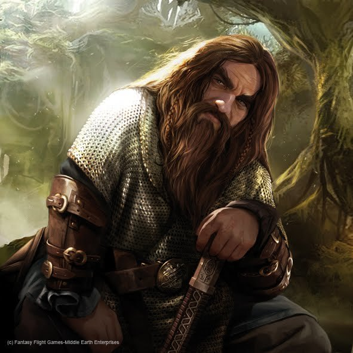

## Companion Table

<table border="1">
	<tr>
		<td span="3">
			Gundren Rockseeker (Male Dwarf, Mining expert)
		</td>
	</tr>
	<tr>
		<td>Abilities</td>
		<td>Saving Throws</td>
		<td>Skills</td>
	</tr>
	<tr>
		<td>Strength: 14 (+2)  
            Dexterity: 12 (+1)  
            Constitution: 16 (+3)  
            Intelligence: 14 (+2)  
            Wisdom: 12 (+1)  
            Charisma: 13 (+1)  </td>
		<td>Strength: +4
            Dexterity: +1
            Constitution: +5
            Intelligence: +2
            Wisdom: +1
            Charisma: +1</td>
		<td>Athletics: +4
    Perception: +3
    Investigation: +4
    Persuasion: +3</td>
	</tr>
</table>

<table>
    <tr>
        <td><b>Gundren Rockseeker (Male Dwarf, Mining expert)</b></td>
    </tr>
    <tr>
        <td>
            Ability Scores:  
            Strength: 14 (+2)  
            Dexterity: 12 (+1)  
            Constitution: 16 (+3)  
            Intelligence: 14 (+2)  
            Wisdom: 12 (+1)  
            Charisma: 13 (+1)  
        </td>
        <td>
            Saving Throws:
            Strength: +4
            Dexterity: +1
            Constitution: +5
            Intelligence: +2
            Wisdom: +1
            Charisma: +1
        </td>
    </tr>
    <tr>
        <td></td>
        <td></td>
    </tr>
</table>

    Name: Gundren Rockseeker
Race: Dwarf
Class: Expert
Background: Prospector
Alignment: Neutral

Proficiency Bonus: +2
Armor Class: 15 (Chain Shirt)
Hit Points: 30 (4d8 + 12)
Speed: 25 feet

Skills:

    Athletics: +4
    Perception: +3
    Investigation: +4
    Persuasion: +3

Languages: Common, Dwarvish

Features and Traits:

    Dwarven Resilience: Advantage on saving throws against poison and resistance against poison damage.
    Stonecunning: Proficiency in History checks related to stonework and double proficiency bonus to check for the origin of stonework.
    Business Acumen: Proficiency in Persuasion checks related to business dealings and negotiations.
    Expertise: Double proficiency bonus on selected skills (e.g., Investigation, Perception).

Equipment:

    Chain Shirt
    Pickaxe
    Miner's Tools
    Dagger
    Explorer's Pack
    50 gp

Gundren is portrayed as ambitious
He is driven by his entrepreneurial spirit and desire for success.

    Mining Expertise: Gundren's background as a prospector and his knowledge of mining can be valuable in navigating underground environments, identifying valuable minerals, and deciphering ancient stonework. He can help the party locate hidden passages, detect traps, or provide insights into the geological aspects of the adventure.

    Information and Quest Hooks: Gundren may have information about other potential quests, rumors, or leads that could expand the scope of the campaign. He can introduce the party to additional plotlines, intriguing locations, or new contacts, leading to further adventures beyond the Lost Mines of Phandelver.

    Factional Support: Gundren could have connections with various factions in the game world, such as local authorities, dwarven clans, or guilds. These connections could offer the party assistance, resources, or even safe havens in times of need. Gundren's reputation and relationships can help establish the party's credibility and open doors to influential figures.

    Trading and Business Opportunities: Gundren's entrepreneurial spirit and business acumen can benefit the party financially. He may have access to rare minerals, magical items, or specialized equipment that he can trade or provide to the party at favorable prices. Additionally, Gundren's connections in the business community can help the party establish trade routes or acquire valuable contacts.

    Ally in Combat: Though not a combat-focused character, Gundren can still aid the party in battle. He could provide support through healing abilities, item identification, or clever tactical advice. If the need arises, Gundren might even wield his pickaxe or dagger to assist in combat, though he may be more effective in a supportive or defensive role.