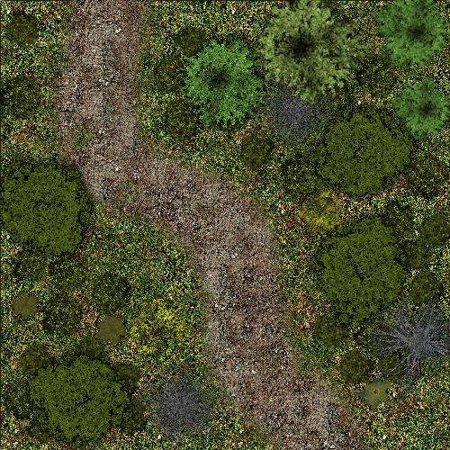

# Pick up the gauntlet

# The Silverspine Watch

## Introduction

**Tags:** #gauntlet

After returning the girl Bess to her village our rat catchers are hailed as heroes. The merchant they saved proposes they protect the cargo to Loukotokia and to the Gudruns estate there. They will pass the Silverpine Watch gate where everthing is not as it should. If they solve the problems of the watch, they will arrive at the Gudruns estate. From which you can continue to the next adventure.

## Adventure Parts

1. Introduction. The merchant Gudrun asks the party to escort them to Loukotokia.
2. Forest Road. They travel on the silverpine road and have an altracation.
3. Silverpine Watch. They reach the watch house but not all is what it should be.
4. Arrival at Loukotokia.

## To Do List
* 

## Goal
* Travel with Gudrun to Loukotokia.

## Blessings
*  

## Obstacles
*  

## Back in Kainga
The adventurers come back into town after their ordeal with the delian tomb and the deathpit.

* Give the players time to act on their new knowledge.
* Previous misdemeanors are forgiven if they save Bess Lebedev.

Afterwards they meet with Gudrun in the Stonehill Inn who offers them a job guarding Gudrun back to town. If the players ask about what sort of dangers they might face or if there is anything specific the merchant is worried about

> Traveling is becoming more dangerous by the day. Even on the kings roads. No one travels without a weapon and no one travels alone if they can afford not to. Some lords try to keep the roads clear. There are watchtowers and fortresses protecting important routes. But bandits and robbers are a constant threat. There is an influx in dangerous monsters attacking travelers as well.

**About the money.** Gudrun is offering each hero 5 gold pieces for seeing them safely to the city of Loukotokia. 
* This is good pay for a group of inexperienced adventurers staying fairly close to civilized lands. Most commoners earn about a silver piece a day and, given the length of the trip, Gudrun is paying the heroes about five times that.
* If the players decide that is not enough and want to try for a better deal, which players will sometimes do on principle, he will increase the pay to 6 gold pieces “and not a copper more.” The negotiation will diminish Gudrun's disposition toward the party.

**Making Travel Preparations.** Point out that each hero has a ten-day supply of trail rations and a waterskin they can refill from the many springs, creeks, and ponds they will pass.

**About the Goods.** Gudrun has a haphazard mix of goods in his cart. He has some bolts of wool and canvas, a few pots and pans, some casks of mead and wine, cut wooden staves, a few iron ingots, a few inexpensive trinkets, and mining equipment. As it is early spring, there is no fruit or vegetables, but there are a few sacks of rye, some pickled fish in a barrel, and some salted pork. It is exactly the sort of stuff a peddler like her would have in his cart. This was bought in the towns general store.

> You are gathered on the townsquare. It is just after dawn; the weather is gloomy. The merchant is getting his cart ready. The dwarf’s cart is half-full of bundles, barrels, crates, and sacks. Two shaggy, miniature horses are harnessed to the cart already. One is solid gray while the other has dark spots over a light coat: Dapple and Mist. He hops up onto the bench at the front of the cart and snaps the reigns and spurs Dapple and Mist, her horses, to a walk. The cart trundles through the gate.

## The Forest Road
  
  
  
> It has been five days since you left Kainga. It is a mid-spring morning and the sky is gray. The weather is breezy and chilly as it is early spring. The narrow dirt road winds back and forth between roll-ing, forested hills. Gundren is driving Mist and Dapple at a comfortable pace.

 **Travel Order. [DC11]** 
> GM: Where are the characters in relation to the cart and the party during travel? There is room in the back of the cart for one person to ride and that would be a good place for the bard or wizard or even the rogue as it gives them a high, but protected, vantage point. Everyone else will have to walk along with the cart.
> GM: How are you traveling? What is the mood? What are you doing?
> GM: Prepare me an appropriate active (or passive) perception check.

**The Snake Accident**
A common adder is basking in the road.
* Spotting the snake: DC15
* Snake intel: Intelligence(Nature) DC12:

The players notice the snake:

> The conversation is interrupted when the horses, Dapple and Mist, get spooked by a snake sunning itself in the road. In their panic, they run the cart off the edge of the road where it becomes stuck. 

Gundren and the player riding on the cart are thrown from the cart. Other heroes have to avoid being struck by the cart.
* Players riding on the cart suffer 1d4 bludgeoning damage
* Dexterity Saving Throw DC11. Failure: the hero is clipped by the cart and takes 1d4 bludgeoning damage.
* An animal check is required to calm the horses

If the player takes a long rest, let them. The moment they want to be on the move. Hit them with the wild hounds.

The SnakeA common adder was basking in the road. The heroes over-
looked it due to its camouflage and the horses nearly stepped 
on it. The snake is still there, staying quite still, waiting for the threat to pass. The snake is afraid of the party, so it will not attack unless a hero gets too close and startles it.The snake is two feet long, two inches thick. It’s pebbly skin is mottled gray and brown.If a hero looks around carefully, they might spot the snake:
Wisdom (Perception) «Passive» DC 18 The hero spots the motionless,  gray-and-brown  snake  in  the  road.  The  hero  can call the party’s attention to the snake, so they all know where it is.
A proficient hero who sees the snake might identify it. The snake is a beast and qualifies as the ranger’s a favored ene-my. Grant the ranger advantage on the check to identify it.
Intelligence  (Nature)  «No  Action»  DC  12  The  snake  is  a  common  adder.  It  was  probably  just  trying  to  warm  itself  when  the  horses  nearly  stepped  on.  It  is  unlikely  to  strike  unless someone gets too close to it. The snake is venomous, but not deadly to humanoids. A loud noise or a thrown ob-ject will likely frighten it off.The snake is easily driven off, but if a hero gets too close it, the snake will strike before slithering away.If the heroes fail to spot the snake, the next hero who moves in the road — to tend the horses or see to Oona for example — gets caught by surprise and bitten by the snake.If one of the heroes tries to kill the snake, you can let them kill  the  snake  without  issue.  The  snake  is  not  a  dangerous  combatant.
The Snake’s BiteIf the snake strikes at one of the heroes, they take 1 piercing damage and might be damaged by the snake’s venom:
Constitution  Saving  Throw  DC  11  The  hero  resists  the  snake’s  venom.  Failure:  The  hero  succumbs  and  suffers   
1d4 poison damage.
If a hero examines the wound from the snake’s bite, they can determine the following:
Wisdom (Medicine) «Requires Proficiency» DC 11  The  bite  is  swollen  and  painful,  but  not  life  threatening.  The  swelling should go down soon, and the bitten hero will not suffer any long-term effects.
Calming the HorsesDapple and Mist are panicking. Their struggles threaten to break their harness, damage the cart, or injure them. If the heroes  ignore  the  horses,  describe  the  creaks  and  groans  coming from the cart. Make it seem like an emergency.If  Oona  is  conscious,  she  can  calm  Dapple  and  Mist  auto-matically.  No  ability  check  is  needed.  Anyone  else  can  at-tempt to soothe the horses:
Wisdom (Animal Handling) «Advantage: Offering Horse Apple  or  Other  Food»  «Disadvantage:  The  Snake  Has  not Been Driven Off» DC 10 Dapple and Mist stop strug-gling and calm down. Failure The horses continue to thrash and struggle.The heroes can try repeatedly to calm the horses. Each time a  hero  fails,  though,  describe  the  strain  on  the  harness  or  cart. Make it seem as if something is going to break at any moment. If this were not a tutorial encounter, there would be long-lasting consequences for failure.If the players come up with any clever ideas to help calm the horses, grant advantage on the ability check. 

Dapple  and  Mist  are  struggling  against  their  harnesses;  the  cart  is  creaking  and  groaning.  If  they  are  not  calmed  quickly,  they  might  break  the  harnesses  or  hurt  them-selves. » Oona  is  laying  motionless  in  the  road.  Blood  is  pooling  around her head. She might have a serious injury and will need help quickly. » There is no obvious sign of anything that might have pan-icked the horses. » The cart’s wheel is stuck in a muddy rut at the edge of the 
road. Until it is freed, there is no going anywhere.Both the unconscious halfling and the panicked horses are 
emergencies. The heroes should not ignore them. If the he-roes seem unsure of what to do, if they are slow to act, or if they ignore either problem, describe how the horse’s strug-gles are damaging the cart or how Oona is not moving and she is getting paler by the moment.If the players are truly struggling with what to do, offer them some help. The rogue and the ranger both know how to take care of animals. The cleric and the wizard both know how to treat  the  injured.  If  the  players  are  doing  everything  right,  but keep failing at their checks, suggest the players try do-ing something to improve their chances. They can use mag-ical spells or look around the scene for tools to help them

Set the Scene » This encounter follows directly from B3 The Accident. » The horses are browsing in the roadside brush; they look around nervously » Remind  the  party  of  Oona’s  status;  is  she  fully  healed,  conscious, or unconscious? » If a hero was bitten by the snake, remind them about the painful, swollen wound. » If  a  hero  was  thrown  from  or  struck  by  the  cart,  remind  them of their bumps and bruises. » If a hero broke up the dead fall in B2 Roadblock with the woodcutter’s axe, remind them of their fatigue » One of the horses wickers nervously as it looks around
Nervous HorsesThe  horses  are  still  shaken  from  their  panic,  but  they  are  also aware of the pack of feral dogs stalking through the un-derbrush nearby. As you set the scene and describe the short rest,  mention  their  nervousness  a  couple  of  times  in  pass-ing.  Subtle  repetition  of  important  details  is  a  helpful  way  of foreshadowing current events.If a hero tries to soothe the horses, resolve the action with an  ability  check.  If  the  players  decide  to  look  around,  skip  the short rest and move on to B5 Feral Dogs.Short RestUse this opportunity to explain how short rests work.
Before letting the heroes spend their hit dice, if one of the heroes  broke  up  the  dead  fall  with  the  lumberjack’s  axe  during B2 Roadblock, tell that player that their character has one less hit die due to fatigue.
Tell the fighter’s player that their character’s second wind 
ability recovers during a short rest. Tell the wizard’s player that  their  arcane  recovery  ability  lets  them  recover  a  spell  slot once per day during a short rest.Take your time with this encounter. It provides a nice break 
between the tense accident and the upcoming fight with the 
feral dogs. If Oona is conscious, interact with the heroes and try  to  start  a  conversation  while  everyone  is  resting.  If  no  one wants to talk, stretch out the rest with some narration. Describe  the  forest  scene,  describe  the  characters  tending  their wounds or eating rations, that sort of thing.
Move OnAfter  the  party  completes  the  short  rest,  Oona  climbs  into  the back of the cart to check her goods before the party re-sumes  their  travels.  The  heroes  take  up  their  positions  in  the travel order.If the party claimed the healer’s kit in A4 The Accident, she notices  that  it  is  gone.  She  does  not  say  anything,  but  her  disposition toward the party is diminished.After checking her goods, Oona climbs onto the cart’s bench and snaps the reigns, but Dapple and Mist just whinny ner-vously. Move immediately on to B5 Feral Dogs

Set the Scene » This encounter follows immediately from B4 A Short Rest » Remind the players that Oona is either on the cart’s bench or unconscious in the cart » Remind  each  player  of  their  hero’s  location  in  the  travel  order.
Call for Action » Up the road, the underbrush rustles. » Three  dogs  emerge  from  the  brush;  they  are  large,  but  skinny, mangy, and scarred. » The dogs waste no time and begin advancing on the party. » Intelligence (Nature) «No Action» «Proficiency  Required»  DC  10  The  dogs  look  like  hunting  dogs  gone  feral.  Their  master  must  have  died  or  abandoned  them,  and they have been struggling to survive in the wild. They are  not  powerful,  but  they’re  desperate  enough  to  attack  the party.
The Feral DogsThe three feral dogs, whose statistics are found in 
Appendix A, attack relentlessly. They are starving and mad 
and will fight to the death.
The dogs emerge onto the road 30 feet ahead of the heroes.If you are not comfortable with the idea of the heroes killing starving  dogs,  keep  the  dogs  alive  at  0  hit  points  and  have  
them flee.
The dogs are no longer domesticated; they have gone feral. They are starving, and they attack immediately. They are not likely to respond to attempts to calm them. However, if one of the players comes up with a clever plan to calm the dogs or drive them off, resolve it using your own best judgment.
The feral dogs focus all their attention on the heroes. Unless 
the  heroes  ignore  them  completely,  they  will  not  go  after  Oona or the horses.
The RoadThe  road  is  a  dirt  track  overgrown  with  weeds  here.  It  is  about 10 feet wide. Scattered trees by the roadside can pro-vide cover. Thick underbrush grows between the trees which 
constitutes difficult terrain.
You  can  use  Map  2  Silverpine  Forest  Combat  Map  in  
Appendix C to represent the battlefield.
OonaDo not roll initiative for Oona. Instead, assume she acts last every round. Oona uses her turn in combat to keep Dapple and Mist from panicking.
The HorsesThe  feral  dogs  frighten  Oona’s  horses,  Dapple  and  Mist.  Someone must keep Dapple and Mist under control, or else the horses will bolt.If  no  one  tries  to  keep  the  horses  under  control  or  the  at-tempt  to  control  them  fails,  the  horses  panic.  When  the  horses panic, describe their attempts to break free and run as you did in B3 The Accident. Make it seem like the har-nesses are going to break any moment, or the horses are go-ing  to  bolt,  or  one  of  the  horses  is  going  to  get  hurt.  Make  it  seem  urgent.  But  do  not  actually  have  anything  happen  unless you want to.If Oona is conscious, she uses her action each turn to control the horses. No ability check is needed.

f Oona is unconscious, any hero can use an action on their turn to keep the horses from panicking that round:
Charisma  (Handle  Animal)  DC  10  The  horses  are  kept  from panicking for one round. Failure: The horses panic.If the players are ignoring the horses and you feel up to im-provising,  have  the  horses  bolt,  trampling  the  heroes  and  
the dogs on the road ahead. Use Dexterity saving throws 
to  see  who  can  dodge  out  of  the  way  and  apply  appropri-ate  damage  to  anyone  who  does  not.  If  one  of  the  heroes  
gives chase, they can catch up to the cart. Use ability checks 
to see if they can jump onto the cart and regain control as appropriate. If the heroes do not catch the cart themselves, Dapple and Mist eventually calm down and come to a stop further up the road.
Move OnOnce  the  last  dog  is  dead  or  driven  off,  silence  falls  over  the road. Although it is only mid-afternoon, the shadow of the  forest  hangs  over  the  road. A  frustrated  Oona  suggests  that the party just make camp for the night and start fresh in  the  morning  and  she  will  brook  no  argument  this  time.

Feral DogMedium beast, unaligned
Armor Class 12
Hit Points 18 (4d8)
Speed 30 ft.
STR
10 (+0)
DEX
14 (+2)
CON
10 (+0)
INT
3 (-4)
WIS
12 (+1)
CHA
7 (-2)
Skills Perception +3
Senses passive Perception 13
Languages —
Challenge 1/8 (25 XP)
Keen Hearing and Smell. The feral dogs has advantage on Wisdom (Perception) rolls that rely on hearing or smell.
ActionsBite. Melee Weapon Attack: +2 to hit, reach 5 ft., one tar-get. Hit: 4 (1d4 + 2) piercing damage.

 
 Oona and any hero riding on the cart are thrown. 

 encounters a fallen tree. The  Oona is  The party must treat her injuries and get the horses under control be-fore they can proceed 
Shaken from the accident, Oona recommends that the party take a break
 but as soon as they get underway again, a pack of feral dogs attacks the party

 the merchant, breaks the awkward silence. She tries to get the heroes talking (B1 Getting to Know You). T (B2 Roadblock) which they must remove from the road.A few hours later, (B3 The Accident). (B4 A Short Rest), (B5 Feral Dogs).

 Following the fight with the dogs, Oona 
declares the day a wash and instructs the party to make camp. While camping, Oona tells the heroes about Silver-pine Watch and its inhabitants (B6 Making Camp).The next day, the party comes upon the body of a traveling tinker who was killed by bloodsucking stirges in the road (B7 The Tinker’s Body). Then, they arrive at Silverpine 
Watch and find its gates closed, blocking all traffic on the 
road (B8 Arrival at Silverpine Watch).The heroes realize they have no choice by to enter the Watch and raise the gates themselves. When they do so, Part B ends and Part C Silverpine Watch begins.
Tutorial EncountersIn this part of the adventure, you will present the players with a series of events and obstacles that happen while the party travels with Oona along the road through Silverpine Forest. These encounters are here to let you show the players how role-playing games work and teach the rules of the game. The game’s concepts are presented in the same order here as they were in chapter 1 of Game Angry: How to RPG the Angry Way.

