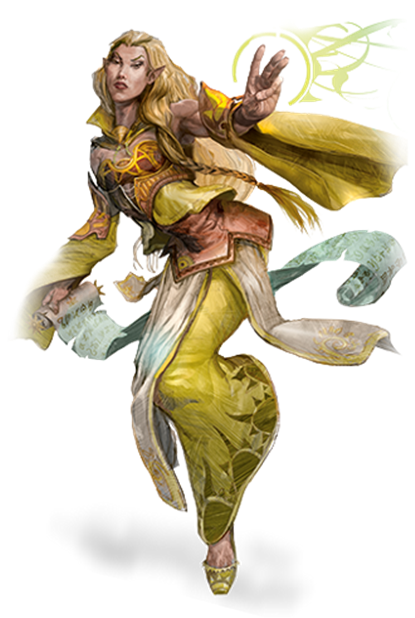

# Elf

**Tags:**  #character #lineage 

"I HAVE NEVER IMAGINED SUCH BEAUTY EXISTED," Goldmoon said softly. The day's march had been difficult, but the reward at the end was beyond their dreams. The companions stood on a high cliff over the fabled city of Qualinost. Four slender spires rose from the city's corners like glistening spindles, their brilliant white stone marbled with shining silver. Graceful arches, swoopingfrom spire to spire, soared through the air. Crafted by ancient dwarven metalsmiths, they were strong enough to hold the weight of an army, yet they appeared so delicate that a bird lighting on them might overthrow the balance. These glistening arches were the city's only boundaries; there was no wall around Qualinost. The elven city opened its arms lovingly to the wilderness.  
 -- Margaret Weis & Tracy Hickman, Dragons of Autumn Twilight

## Attributes

| Attribute | Description |
| --------- | ----------- |
| Lifespan | Nearly immortal by age (they know sickness, death, …) Mature at 100 (=20). Age factor vs Human is factor 10. |
| Height | Base 4ft 6 in [+2d10]; 5 - 6 ft avg; Medium |
| Weight | Base 90 lb [1d4]; 100 lb avg |
| Speed | 35ft |
| Elven Lineage | - Trance (deep meditatation for 4 hours iso sleeping)  - No disadvantage for lightly obscured areas and dim light |
| Elven Sight | Ignore half cover Half prof mod / day you can  - Reroll saving throw vs charm and sleep" |
| Elven Presciense  | Half prof mod / day you can - Reaction to replace any d20 roll within 30 feet |

## About
One of the Proud People. Elves are the only creatures that live in harmony with nature according to them. Logic is the only solution that is applicable. They wil hide their emotions. Part of the reason every other lineage thinks they are arrogant. If their emotions take the upper hand? Run.

Elves do not have to eat but can. They live by absorbing a little bit of life force of every living thing. If they have not eaten in a while their digestive system will perform unsatisfactory. Undead or lifeless environments affect them negatively.

Although they are haughty, elves are generally gracious even to those who fall short of their high expectations, which are all non-elve races. Still, they can find good in just about anyone if the care to learn about them. Will dislike non Proud People linages by default; specific members may become friends.

## Related Links
- [Character Creation](../../20_character_creation.md)
- [Character Lineages](../../22_character_lineage.md)