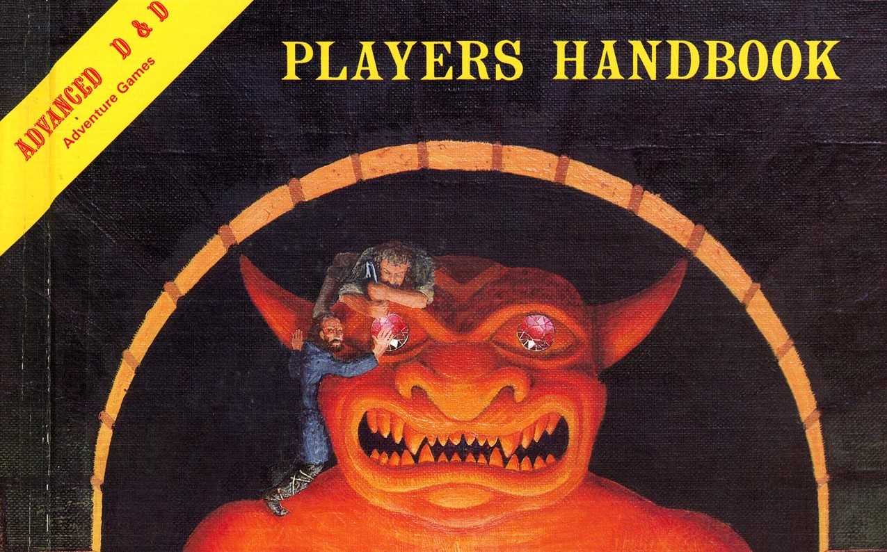

# Games of the World

# Billiards

Billiards (Skill Challenge Competition) - First Team to 8 Successes Wins

    Break - Whoever performs the break makes a Dexterity (Athletics) check, DC12 to sink 1 ball.
    Each Shot - Intelligence (Sleight of Hand) or straight Dexterity -- DC11 to sink 1 ball, +1 additional ball for every 3 points the result is above the DC.

    A critical fail sinks a ball of the opponent's type.
    Each ball that is sunk for your team increases the static DC by +1. (eg the 8-ball is DC18)

    You can make a trick-shot with a Dexterity (Performance) check, increasing the DC by +2. On a success, your opponent has Disadvantage on their next turn.

    On a trick-shot failure, roll 1d8-x where x is how many balls the opponent has left. On a result of 1 or lower, an opponent's ball is sunk.

    A critical failure on a trick-shot, sinks the 8-ball, if sinking the 8-ball causes a loss.
