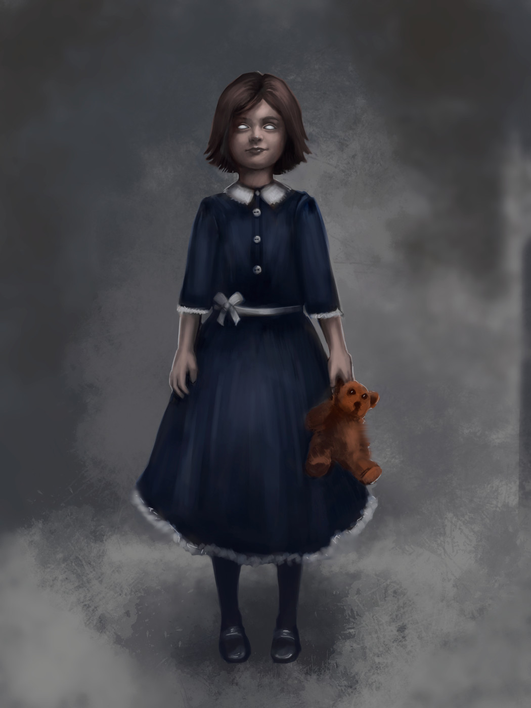

include::aeria_jones.stats.adoc[]

[cols="2a,4a",grid=rows]
|===
|

| 
Aeria Jones is 9 years old and considered "weird" by the other children in the orphanage. They carry around unusual or seemingly random items with her such as a rocks or sticks. They carry a partial deck of tarot cards. She uses them to tell the future. And many children swear she has a pet rat. She could also have mannerisms that set her apart, such as talking to herself, muttering under her breath, or constantly fidgeting with her hands. These behaviors might make the other children uncomfortable and avoid her, further isolating Aeria and reinforcing her unusual behavior.

Aeria was always a little bit different from the other children in the orphanage. Her behavior often made others uncomfortable, and as a result, she was often avoided. Despite this, Aeria is a curious and intelligent child who has a love for the strange and unusual.
|===
