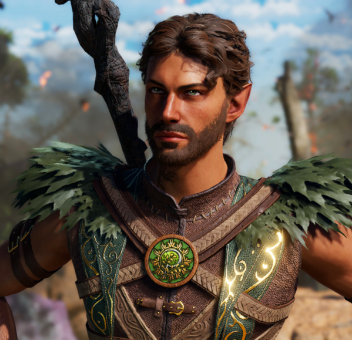

include::cornus_hikoga.stats.adoc[]

[cols="2a,4a",grid=rows]
|===
|

| 
=== Backstory
Is a half-elf druid
Named after the Kornoei flower. Many years ago an elf passed through the village and stayed for some time and had fun with the local priest. She gave birth to a boy and the priest, more interested in his career then children gave it up to the orphanage. To keep his conscience quite he does fundraisers for the orphanage.
Ms Witchling has her suspicions but keeps quit. The flowers of the orphanage front garden started growing, hence his name, Cornus.

|

|
=== After the orphanage

|===