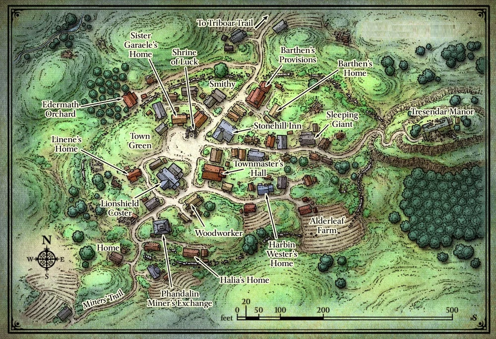

= Lost Mines of Kainga
:toc:

*Tags:* #lostmines

[align=center]
image::./images/cover.jpg

== Summary

The frontier town of Kainga is built on the ruins of a much older settlement. Hundreds of years ago, the old Kainga was a thriving human town whose people were firmly allied with the dwarves and gnomes of the Phandelver's Pact. However, the same ore horde that sacked the mines at Wave Echo Cave laid waste to the settlement, and Kainga was abandoned for centuries. In the last three or four years, hardy settlers from the cities of Neverwinter and Waterdeep have begun the hard work of reclaiming the ruins of Kainga. A bustling frontier settlement has grown up on the site of the old town, and is home now to farmers, woodcutters, fur traders, and prospectors drawn by stories of gold and platinum in the foothills of the Sword Mountains. Unfortunately, more than a few bandits and brigands have settled here as well, taking advantage of the fact that the area has no local lord or authority to chase them off. A gang known as the Redbrands has controlled Kainga for the past two months, extorting and bullying everyone in town. The gang is led by a mysterious figure known to the townsfolk as Glasstaff.

== Goals

During this part of the adventure, the characters can visit the various locations in Kainga and talk to the NPCs there. (See the "Town  description"section for details.) The town is small enough that it takes only a few minutes to stroll from one end to the other. However, the characters arrive late in the day and can't get to more than one or two locations before it's time to seek lodgings for the night. Some locales the characters should visit include the following:

* *Barthen's Provisions*. If the characters have the wagonload of supplies from the "Meet Me in Kainga" adventure hook, they are meant to deliver it to this shop.

* *Lionshield Coster*. If the characters retrieved the stolen goods from the Cragmaw hideout, they might want to return them to the rightful owner.

* *Stonehill Inn*. If the characters have Sildar Hallwinter with them, the knight suggests heading for this inn to find lodgings. If the characters are otherwise looking for a place to eat and sleep, they discover that the Stonehill appears to be the best available option.

== Welcome

> The rutted track emerges from a wooded hillside, and you catch your first glimpse of Kainga. The town consists of forty or fifty simple log buildings, some built on old fieldstone foundations. More old ruins-crumbling stone walls covered in ivy and briars-surround the newer houses and shops, showing how this must have been a much larger town in centuries past. Most of the newer buildings are set on the sides of the cart track, which widens into a muddy main street of sorts as it climbs toward a ruined manor house on a hillside at the east side of town. As you approach, you see children playing on the town green and townsfolk tending to chores or running errands at shops. Many people look up as you approach, but all return to their business as you go by.

If Sildar Hallwinter is with the party,

> Sildar seems much more at ease. "My friends," he says, "let us secure lodgings. I'm told the local inn is very quaint."

[align=center]

=== List of NPC

* Toblen Stonehill: Innkeeper
* Elmar Barthen: Owns a trading post; owes money to the party if you are using the "Meet Me in Kainga" adventure hook
* Daran Edermath: Member of the Order of the Gauntlet with a quest for the party
* Linene Graywind: Runs a trading post and offers a reward for retrieving her supplies
  => Good to the party due to the goods
  
* Halia Thornton: Member of the Zhentarim with a quest for the party
* Qelline Alderlea:  Helpful halfling farmer whose son, Carp, knows a secret way into the Redbrands' hideout
* Hibiscus Tauwi: The priest who runs the local chapel
* Sister Garaele: Half-Elf cleric of Tymora and Harper agent with a quest for the party
* Mayor Cedric Oakheart --original Harbin Wester-- : Townmaster of Kainga with a quest for the party
* Sildar Hallwinter: Member of the Lords' Alliance with two quests for the party

* NPC Mentor for druids: Willow Greenleaf (Herbalist)
* NPC Mentor for warriors: Constable Emeric (police) > Emeric Ermman
* NPC Mentor for rogues: Magnifico the Magnificent (magician)
* NPC Mentor for diviners of Ohm: Hibiscus Tauwi (Priest)
* Pasha (lazy) and rufina (pretty):
* Gilad Shams is now glass-staff but was the friend of Sildar

=== Blessings

x

=== Extra

x

== Stonehill Inn

> In the center of town stands a large, newly built roadhouse of fieldstone and rough-hewn timbers. The common room is filled with locals nursing mugs of ale or cider, all of them eyeing you with curiosity. Its them again!

This modest inn has six rooms for rent (Sildar Hallwinter takes one).

* Toblin Stonehill - The proprietor is a short, friendly young human male named Toblen Stonehill. Toblen is a native of the town of Triboar to the east.

=== Rumors

Narth, an old farmer: 
"Sister Garaele, who oversees the Shrine of Luck, recently left town for a few days, then returned wounded and exhausted." (See the "Shrine of Luck" section for more information.)

Elsa, a gossipy barmaid: "Daran Edermath, the orchard keeper, is a former adventurer." (See the "Ederrnath Orchard" section for more information.)

Lanar, a miner: "Ore raiders have been seen on the east end of Triboar Trail. The town master is looking for someone to run them off." (See the "Townrnaster's Hall" section for more information.)

Trilena, the innkeeper's wife: "Thel Dendrar, a local woodcarver, stood up to the Redbrands a ten day ago when they came by his shop and leered at his wife. *The ruffians murdered him*. Several townsfolk saw it happen. The Redbrands grabbed his body, and now his wife, daughter, and son have gone missing too." (Unknown 15 PART 2: Kainga to Trilena and the other townsfolk, the Redbrands took Thel's wife and children to their secret hideout.)

Pip, Toblen's young son: "Qelline Alderleaf's son Carp said he found a *secret tunnel* in the woods, but Redbrands almost caught him." (See the "Alderleaf Farm" section for more information.)

Freda, a weaver: "The *Redbrands hassle every business* in town, except for the Kainga Miner's Exchange. They don't want trouble with Halia Thornton, who runs it." (See the "Kainga Miner's Exchange" section for more information.)

any NPC at the inn can tell the characters that the *Redbrands frequent the Sleeping Giant* tap house at the east end of town-and that the ruffians are trouble.

== Barthen's Provision

> The proprietor is Elmar Barthen, a lean and balding human male shopkeeper of fifty years with a kindly manner. He employs a couple young clerks (Ander and Thistle) who help load and unload wagons.

NOTE | https://www.thievesguild.cc/shops/

=== Delivering the Supplies.

_If the characters tell him of Gundren Rockseeker's capture, Barthen is saddened by the news and encourages the party to find and rescue the dwarf. He considers Gundren a friend and was excited by talk of discovering the lost mine of the Phandelver's Pact in the nearby hills. Barthen also mentions that two more Rockseeker brothers, Nundro and Tharden, are camped somewhere outside town. Barthen hasn't seen them in a ten day and expects the brothers to return "any day now" to resupply._
_What Barthen doesn't know is that Tharden is dead and Nundro is a prisoner in the mine._

INFO | Barthen pays the agreed amount (10 gp to each character) and takes possession of the wagon and its supplies.

*Intelligence (History) of DC 15*
Character can relate the information from the first two paragraphs of the "Background" section at the start of the adventure.
See part 4, the "Wave Echo Cave" section, for more information.

=== Barthen's News.

_If the characters ask Barthen how business is going, the shopkeeper tells them that the Redbrands are making it hard on everyone, shaking down local businesses and flouting the townmaster's authority. If the characters seem of a mind to do something about it, he tells them that the Redbrands frequent the Sleeping Giant tap house_

== Edermath Orchard
_Daran Edermath is a retired adventurer who lives in a tidy little cottage beside an apple orchard. A fit, silver-haired half-elf well over a hundred years old, Daran is a fighter who served as a marshal and herald for many years in the lands of the Dragon Coast, far to the southeast._

_Upon retiring, he returned to the this region, his original home. Daran is a member of the Order of the Gauntlet, a devout and vigilant group that seeks to protect others from the depredations of evildoers. The order is always vigilant, ready to smite evil, enforce justice, and enact retribution against any who try to subjugate or harm others. Though he is no longer active in the order, he keeps an eye on
happenings around Kainga. He is happy to trade news with fellow adventurers, especially those who appear to hold to these virtues._

_Daran is concerned about the Redbrands, and he would like to see a group of adventurers teach the ruffians a lesson. He tells the characters that it's time someone took a stand against the Redbrands' leader, Glasstaff. Daran knows the Redbrands hang around the Sleeping Giant tap house, but he can also tell the characters that the main Redbrand safe house lies under Tresendar Manor, the ruin at the east edge of town. (See the "Tresendar Manor" section for more information.)

=== Quest: Old Owl Trouble. 

Daran has heard stories from prospectors in the hills northeast of Kainga that someone is digging around in the ruins known as Old Owl Wel!. More disturbingly, several prospectors have reported being chased from the area by undead. He asks the characters to visit the ruins, a couple days march northeast of Kainga, and find out who's there and what they're up to. Daran knows that the ruins are an old watchtower of an ancient magical empire known as Netheril, and he worries that dangerous magic might be dormant there. If the party pursues this quest, see "Old Owl Well" (page 29).

== Lionshield Coster & Linene Graywind

_This building is owned by the Lionshields, a merchant company based in the city ofYartar, over a hundred miles to the east. They ship finished goods to Kainga and other small settlements throughout the region, but this outpost has been hard hit by banditry. The most recent Lionshield caravan due in Kainga never arrived. (It was attacked and its cargo captured by the Cragmaw goblins.)_

> Hanging above the front door of this modest trading post is a sign shaped like a wooden shield with a blue lion painted on it

The master of the Kainga post is a sharp-tongued human woman of thirty-five named *Linene Graywind*. She knows that bandits have raided Lionshield caravans, but she doesn't know who is responsible. In a back room, Linene keeps a supply of armor and weapons, all of which are for sale to interested buyers.

(For prices, see "Adventuring Gear" in the rulebook.)

Linene has a few scruples, however, and won't sell weapons to anyone she thinks might be a threat to the town. Among those with whom she refuses to do business are the Redbrands. She warns the characters that the ruffians are trouble and advises them to avoid the Sleeping Giant tap house.

*Recovered Goods.*

If the characters return the stolen goods found in area 8 of the Cragmaw hideout (or if they left the goods but reveal where they can be found), Linene gives them a reward of 50 gp and promises to help the adventurers any way she can.

== Miner's Exchange & Halia Thornton

The Miner's Exchange is a trading post where local miners have their valuable finds weighed, measured, and paid out. In the absence of any local lord or authority, the exchange also serves as an unofficial records office, registering claims to various streams and excavations around the area. There isn't any real gold rush in Kainga, but enough wealth is hidden in the nearby streams and valleys to support a good number of independent prospectors.

The exchange is a great place to meet people who spend a lot of time out and about in the countryside surrounding Kainga. The guildmaster is an ambitious and calculating human woman named Halia Thornton. In her attempts to establish the Miner's Exchange as the closest thing the town has to a governing authority, she acts as more than a simple merchant. She is also an agent of the Zhentarim, a powerful organization that seeks to exert secret control over the North through wealth and influence. Halia is working slowly to bring Kainga under her control, and can become a valuable patron to the characters if they don't cross her.

Halia doesn't know the location of Cragmaw Castle, but she has heard that the Redbrands have a goblin minion serving them. She suggests the goblin might know the location. She leverages this information to try to persuade the characters into helping her deal with the Redbrands.

=== Quest: Halia'sJob Offer.

If approached by characters she believes she can control, Halia explains that the Redbrands are a problem. She tells how the ruffians loiter around the Sleeping Giant tap house and have a base under Tresendar Manor, on the east edge of town. She then offers the characters 100 gp to eliminate the Redbrand leader, whom the outlaws call Glasstaff, and bring her any correspondence found in the leader's quarters.

*Wisdom (Insight) of DC 15*
Halia doesn't reveal that she wants to take over the Redbrand operation herself. A check indicates she has ulterior motives for wanting the
Redbrand leader dead.

*Joining The Zhentarim*

If the party disposes of the Redbrand leader, Halia Thornton approaches certain members of the group to urge them to join the Zhentarim. She speaks with those who share the Zhentarim's pursuits, such as wealth and power. Even if the party wipes out the Redbrand gang, Halia might still extend the offer in an effort to gain friends (and spies) within the party. If a character agrees, Halia gives the individual the title of Fang.

== Alderleaf Farm & Qelline Alderleaf

A wise female halfling of forty-five, Qelline Alderleaf is a pragmatic farmer who seems to know everything that goes on in town. She is a kind host, and is willing to let the characters stay in her hayloft if they don't want to stay at the Stonehill Inn.

*Carp's Story*

Qelline's son, Carp, is a spirited and precocious halfling lad of ten years. He is enchanted by the idea of being an adventurer and says that he was playing in the woods near Tresendar Manor when he found a secret tunnel in a thicket. A couple of "big ugly bandits" came out of the tunnel when he was there, and met with a pair of Redbrands. They didn't see him, but it was close.

Carp thinks that the bandits have a secret lair under the old manor house. He can take the characters to the tunnel or provide them with directions to the location. The tunnel leads to area 8 in the Redbrand hideout. 

=== Quest: Reidoth the Druid.

Qelline is a longtime friend of a druid named Willow Greenleaf. If she figures out that the characters are looking for specific sites in the area, such as Cragmaw Castle or Wave Echo Cave, she suggests that they visit Willow and ask for her help, "since there's not an inch of the land he doesn't know." She tells the characters that Willow recently set out for the ruins of a town called Thundertree, just west of the woods. The ruins are about fifty miles northwest of Kainga, and she provides directions so the characters can easily find the place. If the party pursues this quest, see "Ruins of Thundertree" (page 30).

== Chapel Of Luck & Hibiscus Tauri

* Hibiscus Tauwi: The priest who runs the local chapel
* Sister Garaele: Half-Elf cleric of Ohm (really Tymora) and Harper agent with a quest for the party

Kainga's only chapel is a small shrine made of stones taken from the nearby ruins. It was dedicated to Tymora, now Ohm. The shrine is in the care of a scholarly acolyte named
Sister Garaele, a zealous young half-elf who despairs of ever ridding Kainga of the Redbrands. Sister Garaele is a member of the Harpers, a scattered network of adventurers and spies who advocate equality and covertly oppose the abuse of power.

The Harpers gather information throughout the land to thwart tyrants and any leader, government, or group that grows too strong. They aid the weak, the poor, and the oppressed. Sister Garaele regularly reports to her superiors on events in and around Kainga. About Hibiscus orginally, but also about Halia Thornton. Garaele knows about the Zhentarim, although she did not give that knowledge to anyone.

=== Quest: The Banshee's Bargain

Recently, Garaele's superiors asked her to undertake a delicate mission. They wanted her to persuade a banshee named Agatha to answer a question about a spellbook. Garaele sought out Agatha in her lair, but the creature did not appear for her. Garaele desires an intermediary to bring Agatha a suitable gift, a jeweled silver comb, and persuade the
creature to tell what she knows about the location of a spellbook belonging to a legendary mage named Bowgentle.

Sister Garaele believes that a character who flatters Agatha's vanity might be able to trade the comb for an answer. She offers the quest to the characters and offers them three potions of healing as payment for their efforts. If the party pursues this quest, see "Conyberry and Agatha's Lair" (page 28)

*Joining The Harpers*

If the party helps Garaele learn the fate of Bowgentle's spell book, the elf privately approaches certain members of the group to urge them to join the Harpers. She speaks with those who exemplify the virtues of the network and possess a desire to enact positive change through information and secrecy. If a character agrees, Sister Garaele awards the individual the title of Watcher.

=== Extra - Tymora

Tymora, often called "Lady Luck," is the revered goddess of good fortune, adventurers, and those who take bold risks in the Forgotten Realms. She embodies the whims of fate, bestowing her favor on those who live by their wits and daring, while guiding the hands of gamblers and explorers. Followers of Tymora, known as Tycheans, believe in seizing opportunities, trusting in the goddess to tip the scales in their favor at critical moments. Her symbol, a coin with a smiling face on one side and a frowning face on the other, encapsulates her dual nature of fortune and misfortune, reminding all that luck can change in an instant.

== The Sleeping Giant & Grista

This rundown tap house is a dirty, dangerous watering hole at the end of Kainga's main street. It is frequented by Redbrand thugs and operated by a surly female dwarf named Grista. If the characters choose to visit the place, run the "Redbrand Ruffians" encounter.

== Town Master's Hall & Cedric Oakheart
_Kainga has no functioning government, but the townsfolk elect someone to serve as town master each year. The townmaster serves as a judge in minor disputes and keeps any records that need to be kept. The current town master is a male human banker named Cedric Oakheart -a fat, pompous old fool. Completely intimidated by the Redbrands, he claims that they're "just a mercenary guild, and not all that much trouble, really."_

> The townmaster's hall has sturdy stone walls, a pitched wooden roof, and a bell tower at the back. Posted on a board next to the front door is a notice written in Common. It reads: "REWARD-Orcs near Wyvern Tor! Those of a mind to face the orc menace should inquire within." The notice bears the town's seal and an indecipherable signature.

The townmaster's hall has a small but serviceable jail in the cellar. The jail consists of two cells, and Cedric carries keys to the cell doors. 

=== Quest: Ore Trouble. 

Cedric is looking for someone to head east on the Triboar Trail, where travelers have reported trouble with a band of orcs near Wyvern Tor. He offers 100 gp to any group that can take care of the problem. If the party pursues this quest, see "Wyvern Tor" (page 35).

=== Quest: Finding Cregmaw Castle

After resting at the Stonehill Inn, Sildar Hallwinter establishes himself at the townmaster's hall. As an agent of the Lords' Alliance, his goal is to bring law and order to Kainga. As such, he wants to find the lost mine of Wave Echo Cave and help the Rockseeker brothers put it back into production, believing that bringing prosperity to the region will help civilize the town.

Sildar also encourages the characters to keep up the pressure on the Cragmaw goblins. He offers the party a 500 gp reward if they can locate Cragmaw Castle an defeat or drive off the tribe's chieftain. Sildar suggests the party might find the castle by searching the lands around the Triboar Trail for more raiding parties (see "Wilderness Encounters" in the "Triboar Trail" section of part 3).

=== Quest: Finding Iarno

After questioning several locals, Sildar learns that Gilad Shams, a fellow member of the Lords' Alliance, disappeared while exploring the area around Tresendar Manor about two months ago, shortly after arriving in Kainga. Sildar asks the characters to investigate the manor and the surrounding area to find and bring back Gilad Shams - or what's left of him, if something killed him. Sildar describes Gilad Shams as "a short, dark-bearded human wizard in his thirties."

Unknown to Sildar, Gilad Shams created the Redbrands, installed himself as their leader, and took the alias Glasstaff to conceal his identity. (The Redbrands call him that because he carries a glass staff.) Once he learns the truth about Gilad Shams, Sildar expresses a desire to have the wizard captured and transported to Loukotokia to face the judgment of a higher authority. Regardless of Gilad Shams' fate, Sildar rewards the party with 200 gp for eliminating the Redbrand threat.

*Joining The Lords' Alliance*

If the party eliminates the goblin threat from Cragmaw Castle or uncovers Gilad Shams' treachery, Sildar Hallwinter privately approaches certain members of the group to urge them to join the Lords' Alliance. He speaks with those who exemplify a desire for the security of civilization through action. If a character agrees, Sildar Hallwinter awards the individual the title of Cloak.

== Tresendar Manor

More a castle than a house, Tresendar Manor stands at the east edge of town on a low hillside amid woods and thickets. The ancient manor has long been abandoned, but its cellars have been converted into a Redbrand stronghold. If the characters investigate this place, they find the entrance to the Redbrand hideout.

== Redbrand Ruffians

Within a day or so of the adventurers' arrival in Kainga, a confrontation with the Redbrands becomes inevitable. This can happen in a number of different ways:

* After speaking with a number of NPCs in town, the characters decide to confront the Redbrands at the Sleeping Giant tap house.
* The characters decide to investigate Tresendar Manor. Skip the encounter and go straight to "Redbrand Hideout."
* If the characters show no interest in the Redbrands, a gang of the ruffians seeks them out and picks a fight in street. Run this encounter as the characters are leaving one of the locations in the town.

=== Confrontation

*At the sleeping giant*

> The Sleeping Giant is a ramshackle taproom at the east end of town. Four human ruffians linger on the covered porch, perched on empty ale barrels or leaning against the wall. They all wear grimy scarlet cloaks, their sullen stares fixed on you as you approach. One of the thugs spits on the ground. "Well, well," he snarls. "Here's a whole pack of little puppies. What do you want, puppies? Come here to bark at us?"

Continue the insults and baiting as long as you like. The Redbrands attack in a round or two if the characters don't. Neither side is surprised, because it's obvious that a fight is brewing. The group consists of four Redbrand ruffians. If three of them are defeated, the last one flees toward Tresendar Manor.

*In the street*

If the Redbrands confront the characters in the street, read:

> As you head back into the street, you see four armed ruffians waiting for you. All of them are humans wearing grimy red cloaks, their hands on their weapons as they watch you. One of the ruffians spits on the ground. "Time for you to move on, strangers. Give us your stuff, and be on your way." 

*Fight Development*

Redbrands who are captured or charmed by the characters can impart useful information. (See the "What the Redbrands Know" sidebar on page 20.) Townmaster Cedric Oakheart won't want to keep Redbrand prisoners until he knows the whole gang has been defeated, but the characters can easily persuade or intimidate him into locking up any prisoners they capture for at least a few days.

If the characters kill the ruffians, most members of the town are grateful. One exception is the town master, who fears Redbrand retaliation. Harbin doesn't punish the characters but warns them not to cause trouble. 

*Aftermath? Do the players need help?*

After the "Redbrand Ruffians" encounter, the players should feel it's time to deal with the rest of the gang. If they aren't clear that investigating the Redbrand hideout should be their next move, have one ofthe NPCs they've already met in town make the suggestion directly and point them toward Tresendar Manor. If the players want to follow other leads in the area, it's okay to move on to part 3 of the adventure and let the ruffians wait. The next time the characters return to Kainga, make it clear that the Redbrands are causing even more trouble, and that they need to be dealt with.

