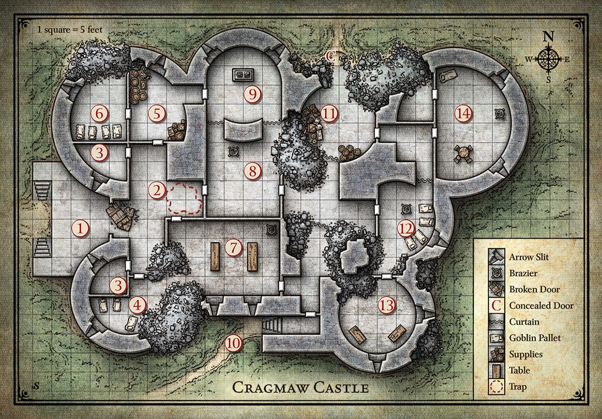

= Lost Mines of Kainga: Cragaw Castle
:toc:

*Tags:* #lostmines

[align=center]
image::../handouts/cragmaw_castle_ruins.jpg[]

== Summary

The Cragmaw tribe consists of marauding bands and rival goblinholds scattered throughout the area. However, tne chieftain is grudgingly recognized by all others as supreme: King Grol of Cragrnaw Castle. Cragmaw Castle is not a goblin construction, nor is that the structure's original name. Raised by a talented wizard-noble of old Loukotokia, an ancient realm that once controlled much of the North, the stronghold consists of seven overlapping towers; however, its upper levels have long since collapsed to heaps of crumbling masonry. Only the ground floor is still sound enough to be habitable.

== General Features

The centuries have not been kind to Cragmaw Castle. The goblins have shored up the weakest areas beneath its falling towers with crude timbers, but it's only a matter of time before the structure collapses completely. +
*Ceilings.* Ceilings are 15 feet high unless noted otherwise. +
*Doors.* Interior doors are made of wood reinforced with iron bands. They have neither locks nor keyholes. It takes a successful DC 15 Strength check to break down a doorthat is barricaded shut. +
*Floors.* Cracked and uneven flagstones conceal a dirt floor underneath. +
*Light.* A small amount of natural light filters through the arrow slits around the castle. During the day, this provides dim light in most areas. At night, all areas are dark. +
*Walls.* Exterior walls and load-bearing interior walls are 5 feet thick, with 3 feet of mortared fill sandwiched between 1-foot-thick courses of hard stone blocks. +
*Interior* walls are 1-foot-thick worked stone. Arrow slits in the castle walls are 10 feet above the outside ground level, 4 feet above the interior floor level, 8 inches wide, and 4 feet high. A creature on one side of an arrow slit gains three-quarters cover against attacks from the other side (see "Cover" in the rulebook).

== Disguised Characters

Rather than storm Cragmaw Castle with weapons in hand, clever characters might try to talk their way inside. For example, they might don the scarlet cloaks of the Redbrands and claim to be emissaries sent by Gilad "Glasstaff" Shams, the Redbrand leader, to meet with King Grol. It's okay if the characters circumvent combat and talk their way past castle defenders. Both the Cragmaw tribe and the Redbrands work for the Black Spider, so the goblinoids aren't likely to attack the party if they claim to be working in the Black Spider's interest.

If the characters try to perpetrate a deception as a group, have them each make a Charisma (Deception) check contested by the monsters' Wisdom (Insight) checks, and give the characters advantage on their checks if the deception is particularly well planned or roleplayed. If at least one character wins the contest, the deception is a success. You may award XP for monsters fooled by the deception. As the party makes its way deeper into the castle, additional checks might be required, at your discretion.

== Castle Map

[align=center]

== 1. Castle Entrance

The main gates between areas 1 and 2 are made of bronze-covered wood, but they are corroded and collapsed. No monsters dwell here, but the goblin sentries in area 3 are supposed to be keeping watch. They glance only occasionally out of the arrow slits, however, so characters who move quietly might be able to creep past them.

> The castle consists of seven crumbling towers of different sizes and heights, but the upper stories are all in varying states of collapse. A short flight of steps leads up to a terrace in front of the main entryway. Past the wreckage of a pair of sundered doors lies a shadowed hall. Round towers loom over the entranceway, with dark arrow slits looking down on the terrace.

[IMPORTANT]
====
Have each character make a Dexterity (Stealth) check. The lowest check is the DC for the goblins' Wisdom checks of 12 to notice the party.

If the goblins spot the characters (or if the characters approach openly), the goblins shoot arrows from behind the arrow slits. However, they can't fire directly at enemies at or past the broken gate. The goblins also shout loudly enough to alert their comrades in areas 4 and 6 that the castle is under attack.
====

== 2. Trapped RAPPED HALL

Once the castle's foyer, this wide hall makes a dangerous battleground...

> Doors stand closed to the north and south, with a crumbling mound of rubble partially obscuring the southern hall. To the east, a broad corridor ends in two more doors leading south and east. The corridor is cluttered with dusty rubble and
fallen plaster from a partial collapse of the ceiling overhead.

If the goblin sentries in area 3 raised the alarm, the goblins and hobgoblins in areas 4 and 6 come running out of the north and south doors at the same time. They attack from both directions, trying to overwhelm the adventurers and drive them out of the castle.

*Trap.* The dusty plaster and rubble in front of the door leading to area 8 conceals a copper tripwire connected to linchpins hidden in the ruined ceiling. Spotting the tripwire requires a passive Wisdom (Perception) score of at least 20, or a successful DC 10 Wisdom (Perception) check if characters are actively searching for traps in the area. Once spotted, the tripwire is easily avoided and disarmed (no ability check required).

Any creature that walks over or through the rubble without avoiding the tripwire triggers a cave-in of woodenbeams and heavy stones. (The area of the collapse is marked on the map.) Any creature in the area when the trap triggers must succeed on a DC 10 Dexterity saving throw or take 3d6 bludgeoning damage from the falling
rubble (half as much damage on a successful save). 

The noise of the collapse puts the monsters in areas 3, 7, 8, and 9 on alert.

== 3. Archer Post

Cragmaw Castle's main defenses are its secret location and the appearance of having been abandoned. In addition, King Grol posts sentries to drive off intruders who get too close.

> This small room is littered with debris. The arrow slit opposite the door offers a fine field of fire over the terrace in front of the castle gates.

Two goblins occupy each of these two rooms. By taking turns shooting arrows and ducking back, both archers can fire each round at targets outside. When characters enter the room, the goblins drop their shortbows and draw their
melee weapons.

== 4. Ruined Barracks

The Cragmaw goblins make use of every bit of available space in the castle.

> The southwest tower of the castle is little more than a heap of rubble. Several ragged bedrolls are scattered across the remaining floor space, and a small, twisting passage leads east through the ruins.

[IMPORTANT]
Any loud noises here attract the attention of the goblins in area 7. One goblin comes to investigate the disturbance. If it doesn't return, or if it spots trouble and sounds the alarm, the others investigate.

Three goblins bunk here. Though the rubble appears dangerous, the tower is stable, and the eastern passage is safe.

== 5. Storeroom

Caravans raided by the Cragmaws along the High Road and the Triboar Trail supply provisions for the castle.

> Old casks of salted meat and sacks of rotting grain fill this storage area. Among the supplies, you see a bloody suit of chain mail, a heavy crossbow, and an unsheathed longsword with the emblem of Neverwinter worked into its hilt

Though the stores here are not edible by human standards, the goblins can tolerate them when fresher food isn't available. 

* One small cask is filled with an exceptional dwarven brandy, which the goblins overlooked because of its size. The cask contains the equivalent of twenty glasses.

A character who imbibes a glass of brandy regains 1 hit point, but a character who drinks two glasses within 1 hour becomes poisoned for 1 hour. 

*Sildar's Gear.* The chain mail and longsword belong
to Sildar Hallwinter. Sildar is grateful if at least his
longsword is returned to him.