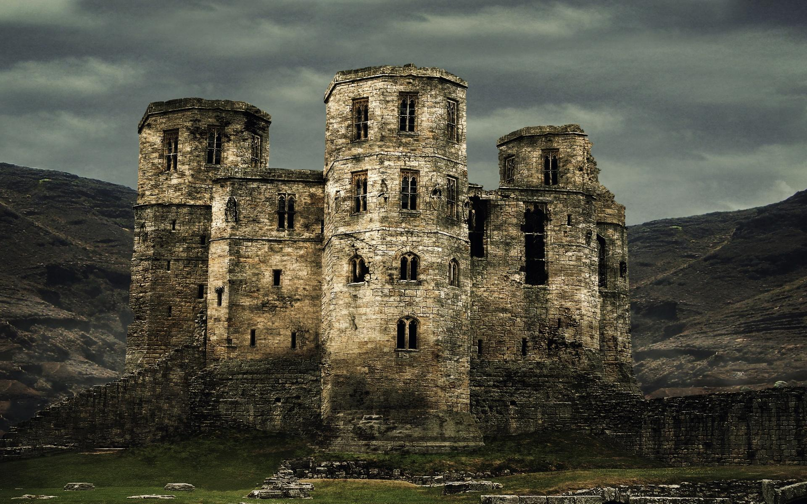

= Lost Mines of Kainga: Cragaw Castle
:toc:

*Tags:* #lostmines

[align=center]

== Summary

The Cragmaw tribe consists of marauding bands and rival goblinholds scattered throughout the area of the Triboar Trail and the Neverwinter Wood. However, tne chieftain is grudgingly recognized by all others as supreme: King Grol of Cragrnaw Castle. Cragmaw Castle is not a goblin construction, nor is that the structure's original name. Raised by a talented wizard-noble of old Phalorm, an ancient realm that once controlled much of the North, the stronghold consists of seven overlapping towers; however, its upper levels have long since collapsed to heaps of crumbling masonry. Only the ground floor is still sound enough to be habitable.

== General Features

=== Castle Entrance

The main gates between areas 1 and 2 are made of bronze-covered wood, but they are corroded and collapsed.

> The castle consists of seven crumbling towers of different sizes and heights, but the upper stories are all in varying states of collapse. A short flight of steps leads up to a terrace in front of the main entryway. Past the wreckage of a pair of sundered doors lies a shadowed hall. Round towers loom over the entranceway, with dark arrow slits looking down on the terrace.

No monsters dwell here, but the goblin sentries in area 3 are supposed to be keeping watch. They glance only
occasionally out of the arrow slits, however, so characters
who move quietly might be able to creep past them. Have
each character make a Dexterity (Stealth) check. The
lowest check is the DC for the goblins' Wisdom checks to
notice the party.
DEVELOPMENTS
If the goblins spot the characters (or if the characters
approach openly), the goblins shoot arrows from behind
the arrow slits. However, they can't fire directly at enemies
at or past the broken gate. The goblins also shout loudly

[align=center]
image::../maps/cragmaw_castle_dm.jpg[]

== 

