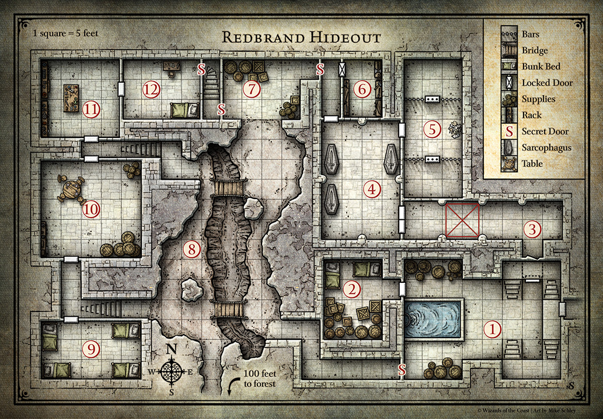

= Lost Mines of Kainga: Redbrand Hideout
:toc:

*Tags:* #lostmines

[align=center]
image::./images/cover.jpg

== Summary

The Redbrands' base in Kainga is a dungeon complex under Tresendar Manor. Before the manor was ruined, its cellars served as safe storage or food and water in the event that the estate was attacked, while an adjoining crypt provided a resting place for the deceased members of the Tresendar family. The Redbrands have since expanded the cellars to suit their own purposes, adding slave pens, workshops, and barracks.If the characters begin their search at Tresendar Manor, they enter the dungeon in area 1. If they instead follow Carp Alderleaf to the secret tunnel the lad found, they enter the dungeon by way of area 8.

== General Features

The hideout consists of well-built dungeon chambers with flagstone floors and walls of dressed stone blocks. The western end of the complex is lower than the eastern end, with stairs leading down as the characters explore. Ceilings. Passages and chambers are 10 feet high unless otherwise indicated.

Doors. All doors are made of wood with iron handles, hinges, and built-in locks. They are unlocked unless the text states otherwise. Gilad Sham (area 12) and a bugbear named Mosk (area 9) each carry an iron key that can lock or unlock every door in the complex. A locked door can be picked with thieves' tools and a successful DC 10 Dexterity check. A door can also be broken down with a successful DC 20 Strength check.

Secret Doors. An "S" on the Redbrand Hideout map indicates the location of a secret door. Secret doors are made of stone and blend in with the surrounding walls. Spotting a secret door from a distance of no more than 10 feet without actively searching for it requires a passive Wisdom (Perception) score of 15 or higher, whereas a character who takes the time to search the wall can find the secret door with a successful DC 10 Wisdom (Perception) check. Secret doors swing open on hidden iron hinges and are not locked. 

Light. Most areas are brightly lit by oil lamps in wall sconces, refilled every few hours as needed.

[align=center]

== 

