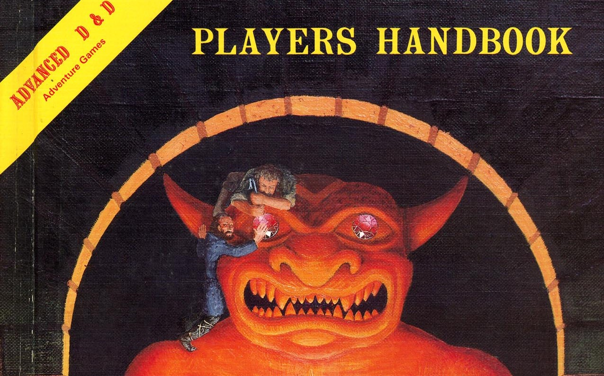

# About playing together

**Tags:** #table, #social

## TL;DR
Respect the players, the game, and the social contract of the group. Ideally, players come to the gaming table with the same goal: to have a fun time together.

## Safety, Accessibility, and Respect
Just like how some movies or television shows are more appropriate for some audiences than others, so too can some games be appropriate for one table of players, but not for another. Just as in some physical games or sports there are specialized tools and equipment to help keep players safe and ensure game accessibility, so too there are there tools to help establish a gaming environment where everyone involved can have fun.

Awareness, consent, and treating others how you want to be treated are the essential foundations for 
creating a safe and accessible toolset at your table. If one person’s fun is coming at the expense of another’s enjoyment, something has gone off track, and it’s time to re-evaluate and course correct. Come to a consensus on game- and table guidelines before you start playing!

**Foster respect.** Don't bring personal conflicts to that table or let disagreements escalate into bad feelings. Humor is allowed, jesting too. Keep it funny for everybody. Don't touch other peoples dice if they're sensitive about it.

**Player Discomfort.** Occasionally things may happen in-game that makes a player unconfortable. There maybe times where everyone agreed about a particular topic in session-0, but when it actually surfaces in-game, the player may find out that they in fact are NOT comfortable with it. Talk to each other. If you want to talk about something, just call a time-out. We can talk about a situation (or after the game) about whatever it is that makes it not fun for you. A player keeps turning you into a rave rabbit? The story becomes too dark? Another player one keeps touching your dice? If you do not speak up. We won’t know!

**Avoid distractions.** Please try not to doze off or go on your phone to browse memes while we're playing. Especially during combat, following along and knowing what you want to do on your turn will make the game more fun. It'll help everyone stay in character and enjoy the story. No electronics at the table is the general rule. If players constantly delay the game by being distracted their turn might be skipped. Everybody has bad days but if persistent the group might need a conversation.
Exception: game related for character sheets.  
Exception: while playing remote.

**Respect the host.** If the host has basic house rules? Follow them e.g. taking of your shoes. They are providing you with a place to play and most likely snacks and beverages and is thus the king/queen/whatever they want of their castle. Decide before a session who will bring food and drinks.

**Alcohol.** We do not play when we are drunk. Enjoy but drink in moderation. Know when to stop.

**Narcotics.** No.

**The most important rule of all. Everybody has fun! Otherwise no one has fun!**

## Missing Players
Be on time and ready to play. Not always an easy task, you have a life and things happen, so let people know your ETA. When 2 or more players are absent the game is cancelled. If you can’t be there, it happens to all of us, there are three options.
* There is suddenly a reason why your character is not there. Try to fit in the story.
* The character is controlled by another player as a retainer and stays on the background.
* The character is an NPC for that session and follows in the background.
* The character is not there. They stay home, camp, castle, ... you get it right.

## Table Talk
Make it clear who's speaking: the character or the player (out of character). Decide how you feel about a player sharing information that his or her character wouldn't know or that the character is incapable of sharing as a result of being unconscious, dead, or far away. Are you all right with players retracting what they just said their characters did?

## Rule of Cool.
Creativity will be awarded. Not just by getting inspiration but you using your character's ability in combat in an original way might get you extra damage, advantage, or a +2 on a roll for instance. Ref. That Pat Rothfuss BS. The cooler it is the more likely it is to work, rules will be bent but rarely broken to accommodate.

The DM might roll for a certain check if he wants to keep the result hidden for the group. E.g. The DM rolls the stealth check. This keeps the players “in the dark” and more to the story. You will always be asked about describing the situation. What does the reluctant Antichrist, eleven-year-old Adam Young, perhaps better known as the leader of the Them, one of Lower Tadfield 's two gangs, do when he investigates the room? Checks under the bed, the rug, looks at the books, … Players will optimize the fun out of the game if you let them. C'mon Man. Be honest. You want to win, so will act accordingly. By keeping certain rolls from the players, the DM can ensure the story wins over maximizing the profit.

## Spotlight Hogging
Everybody deserves their moment to shine. Period. Each character can have unique abilities or a personality that the player is proud of. Let everybody have their moment in the spotlight. A barbarian with int -2 has no play in arcane or history checks (overlooking humorous exceptions). Like mentioned before, it is a collaborative game, allow each player their moment to be awesome.

## Rules Lawyering
It is permitted to tell the DM they forgot, misinterpreted, ... a certain rule. The DM is human and not an eladrin elf with the keen mind feat. But if the DM says ‘méh’ then it is what it is. Sometimes this has a reason, it might be one of the house rules, or just maybe the ruling just fits the situation better. To keep the game moving and thus preventing the game from boring everyone at the same time, the DM will make a ruling. To make sure the issue is addressed next time, make a note of it and discuss it with the DM after the session.

## About Meta-gaming
What is Meta-gaming? What we’re talking about is using real-life knowledge to frame the decisions of in-game characters who do not possess that knowledge and who, without that knowledge, would possibly act differently. Yes, you know that vampires don’t like garlic and hate it when they are stabbed with wooden stakes. But your level 1 peasant character with -2 to wisdom does not. When in doubt ask the DM. Try to see the world through the eyes and knowledge available of your character. Ignoring that might have consequences. Let just say that meta knowledge can be homebrewn...

There is no problem in talking to each other in combat or when discussing with NPC’s. Just make sure the DM knows what is OOC and not. If discussions take too long, the DM might make a decision for you, or skip that turn, the NPC or BBEG might react first, or another in-world event. E.g. you are all ex-soldiers now for hire, part of an elite contra espionage unit. Of course you discussed combat tactics during downtime. But keep a line between the actions of your character and the knowledge you as a player have over the different handbooks and the world.

In short. Don't share information that that you know but your character wouldn't know or that the character is incapable of sharing as a result of being unconscious, dead or far away. If you want to know if your character would know something, ask the DM. Often, you'll be able to make History, Religion or similar check, or be able to research that information in game.

**Insight Detector** A small note about Insight. This is not a lie-detector-machine. It’s a feeling you get, twitches the other person inhibits, speech patterns and the like. Sometimes people are hard to read.

## Min-Maxing
Min Maxing is tolerates as long as it does not become an issue. For some players this is the fun of the game. So why take it away from them? By default we encourage veterans to help newer players with their PCs. Remember, it is also fine to play unoptimized characters as well. This might be campaign dependent as not every campaign is suited for under or over optimised player characters.

## Gameplay and balance
A serious game where emotions are real, role-play is important and actions have consequences. Being unrespectful to a figure in power might have nasty consequences. Encounters are built for verisimilitude. That means there is a real chance that you just can’t win a fight with brute force. It’s the DM job to foreshadow the dangers of the world. It is the players job to search for a solution.

The world is what it is. The same is true for the encounters. You as players need to know what you can handle and how. Be inventive. Know what your character’s actions and motivations are and act accordingly. Sometimes you hit as hard as you can. Maybe talk your way out of it, or just evade it all together. The world will kill you. Your character will die if that is how the story unfolds. Be smart and creative. Ask the DM, although i have the craziest idea that he will say ‘You can certainly try!’.

Humor is of course an important part of the meta-game. Although a character’s heartbreak about their never-to-be love triangle with Lionel Reinhardt, the god’s personal gift to the world, makes the character depressed, does not mean that player has to be.

Although we strive for a combination of role-play and combat, players can always help steer the DM in role-play vs combat. And not all encounters need to be solved by violence. If however a murderhobo moment (or adventure) is more suited at that moment a solution can always be found. Talk to your DM. That goes for a lot of things.

In short. The game master poses a problem to the players. It is your job to find the solution.

## Character Party fit
That 'loner' character? Are they allowed? If so, at what limits? Is it ok if a PC just tags along ONLY to do combat & avoid anything social? D&D is a social based game, you may wish to encourage your players to create characters that play well with others and that will fit with the party. On the other hand, you may want to be mindful about players potentially bullying other players into playing races & classes they do not want to play. Party fit should not limit class & lineage choice. Talk to each other about the type of party you all like.

## Player vs Player.
The game we play is a collaborative experience. Both players agree or no players agree. That goes for everything, stealing, fighting, hiding treasure, ... You can’t simply attack a party member because they spoke poorly about your character’s god or if they have made a mistake that goes against your character’s alignment. No one enjoys the death of a character they’ve poured their heart and soul into. If a PvP conflict occurs or is anticipated to occur, the player seeking to initiate confrontation must speak with BOTH the DM and the character subject of the confrontation. BOTH players MUST have a PvP conversation beforehand and BOTH MUST agree that they’d be willing to loose the conflict.

**Player Secrets** There is no problem with a character having secrets. As always make sure they lead to a fun and memorable experience / conclusion. The DM would most likely want to be in on it *wink* *wink*.

## Player Agency
Player agency is about giving players the time, space, and resources needed in order to make decisions in games. Making sure that players are provided with meaningful decisions during their play. The meaningful aspects of decisions is the heart of what gives players agency in games. This includes being able to benefit (or suffer) the consequences of these decisions.  Sometimes those decisions affect  the player character or other characters within the game. Sometimes these decisions affect your overall strategy and how the characters will eventually live or die. 

We define player agency by three criteria:
* The player has control over their own character's decisions.
* Those decisions have consequences within the game world.
* The player has enough information to anticipate what those consequences might be before making them in so far the story permits.

Some player groups like a story driven game with a beginning and an end, which is a way that a lot of D&D modules are written. However, once that story arc comes to an end, what next? (Railroading) Other groups prefer something like an improvised sandbox, where the unknowns in the game world are as obscure to the DM as to the players. The game can go in a lot of unexpected directions this way, which for some groups is immense fun.

We try to go for a combination of both systems where they are applicable. Although player agency will be stimulated as much as possible, there will be times when it can be taken away. E.g. cut-scenes to describe a certain scene (might involve skill challenge) or by fast forwarding you to a certain location. The BBEG (big bad evil guy) charms your character to do certain things. You can play these scenes, but if you chicken out, the DM will rectify this by roasting that bird.

## Ethic Concerns & Topics
This part will cover mature topics which may or may not trigger people, it is not the intention to do so. This is in fact here to avoid just suddenly triggering players, by bringing these out in the session-0 discussion. They can be discussed and should be discussed in a mature respectful manor. Its important to include a preface to this topic-set. Be as respectful & as frank as possible but ask for forgiveness incase you happen to fall short, these are not easy topics to discuss but should be brought up at the table during Session-0 regardless. For these topics, it is important to address every player at the table for their individual input & then individual consent.

If gender models, attraction, sexual orientation, racism, slavery, torture are a problem let people know!
