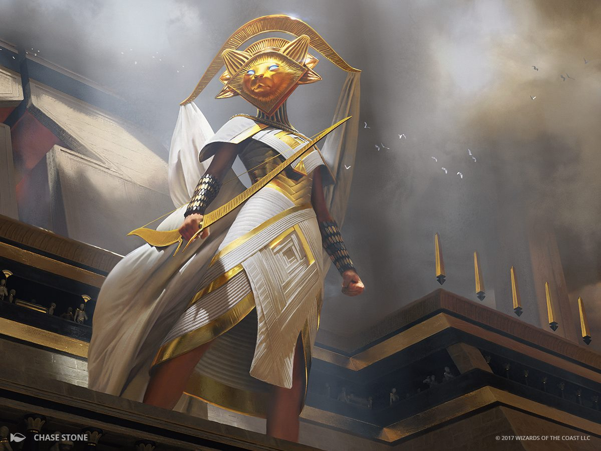

# Aasimar

**Tags:**  #character #lineage 

I SAW HER, WREATHED IN WINGS OF PURE LIGHT, HER eyes blazing with the fury of the gods. The bone devils stopped in their tracks, shielding their faces. Her blade, now a brand of light, swept once, twice, three times. The devils' heads hit the ground, one after another. And thus we learned that an aasimar traveled in our ragtag band.  
 --Geldon Parl, Of the 'Jyranny of Dragons

## Attributes

| Attribute | Description |
| --------- | ----------- |
| Lifespan | Up to 200 years, mature at 20, 150 is old |
| Height | Base 4 ft 5 in [2d8]; 5 - 7 ft avg; Medium |
| Weight | Base 75 lb [2d4]; 100 lb avg |
| Speed     | 30 ft |
| Angelic Lineage | Lineage damage: radiant  Half prof mod / day Lineage spells:   - Light   - Guidance |
| Angelic Resistance | Lineage damage resistance Extra lineage spells:  - Lesser restauration  - Devine favor |
| Angelic Immunity | Lineage damage immunity Extra lineage spells:  - Greater restauration  - Zone of thruth |

## About
Aasimar bear within their souls the light of the heavens. They are descended from humans with a touch of the power of Mount Celestia, the divine realm of many lawful good deities. Aasimar are born to serve as champions of the gods, their births hailed as blessed events. They are a people of otherworldly visages, with luminous features that reveal their celestial heritage.

An aasimar, except for one who has turned to evil, has a link to an angelic being. That being – usually a deva – provides guidance to the aasimar, though this connection functions only in dreams. As such, the guidance is not a direct command or a simple spoken word. Instead, the aasimar receives visions, prophecies, and feelings.

Despite their celestial origin, an aasimar is mortal and possesses free will. Most aasimar follow their ordained path, but some grow to see their abilities as a curse. These disaffected aasimar are typically content to turn away from the world, but a few become agents of evil. In their minds, their exposure to celestial powers amounted to little more than brainwashing. The angels that guide them see the world from a distant perch. An aasimar who wishes to stop and help a town recover from a drought might be told by an angelic guide to push for-
ward on a greater quest. To a distant angel, saving a few commoners might pale in comparison to defeating a evil cult.

Aasimar are generally viewed with admiration and respect by most people, who see them as emissaries of the gods. Many people seek their guidance or assistance in matters of religion or spirituality or for good luck. However, some people may also fear or mistrust Aasimar, particularly those who worship evil deities or demons.

As for Aasimar of different divine lineages, they may not necessarily be in conflict with each other, but they may have different goals or priorities depending on their alignment and the gods they serve. For example, an Aasimar who serves a lawful good deity may be more concerned with upholding justice and protecting the innocent, while an Aasimar who serves a chaotic good deity may be more focused on freedom and individual liberty.

## Related Links
- [Character Creation](../../20_character_creation.md)
- [Character Lineages](../../22_character_lineage.md)