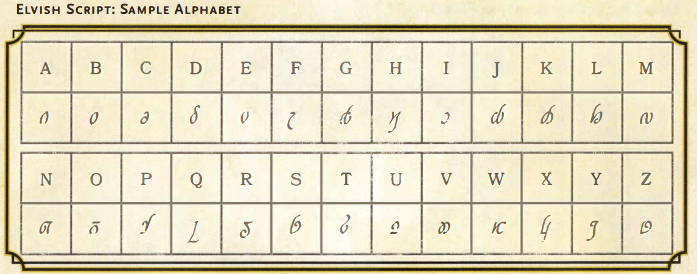
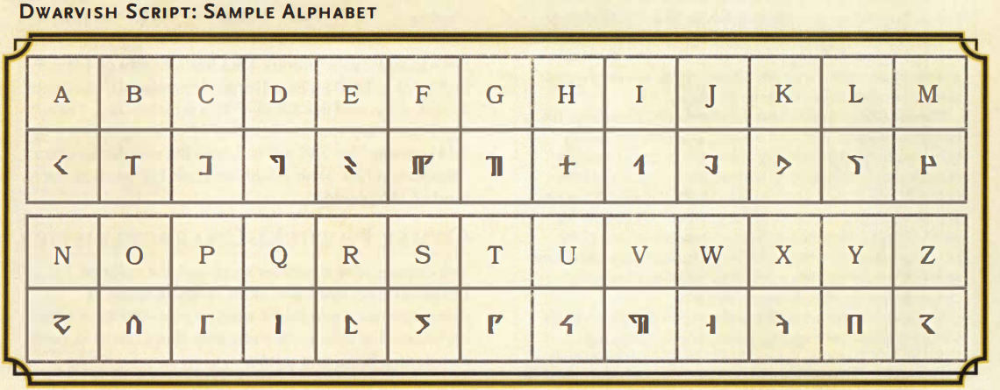
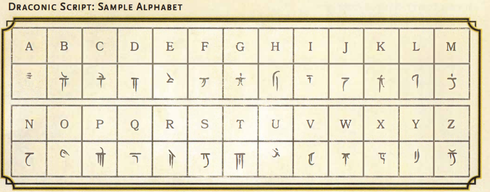

# Playable Languages

**Tags:** #character, #language 

Your race indicates the languages your character can speak by default, and your background might give you access to one or more additional languages of your choice.

| Language | Speakers      | Script      |
| -------- | ------------- | ----------- |
| Common   | Humans        | Common      |
| Dwarvish | Dwarves       | Dwarvish    |
| Elvish   | Elves         | Elvish      |
| Giant    | Ogres, Giants | Dwarvish    |
| Gnomish  | Gnomes        | Dwarvish    |
| Goblin   | Goblinoids    | Dwarvish    |
| Halfling | Halflings     | (Oral only) |

With your DM's permission, you can instead choose a language from the Exotic or Secret Languages table, such as thieves' cant or the tongue of druids.

| Language           | Speakers              | Script         |
| ------------------ | --------------------- | -------------- |
| Abyssal            | Demons                | Infernal       |
| Celestial          | Celestials            | Celestial      |
| Draconic           | Dragons, Dragonborn   | Draconic       |
| Infernal           | Devils                | Infernal       |
| Primordial         | Elementals            | -              |
| Spell Incantations | Mages                 | Unique to user |
| Thieve's Cant      | Members thieves guild | Glyphs         |
| Tongue of Druids   | Member druid cirlce   | Glyps          |
| Undercommon        | Underdark creatures   | Elvish         |

Example of Elvish

Example of Dwarfish

Example of Draconic

## Related Links
- [Character Creation](../20_character_creation.md)
- [Character Cultures](../23_character_culture.md)
- [Character Backgrounds](../24_character_background.md)