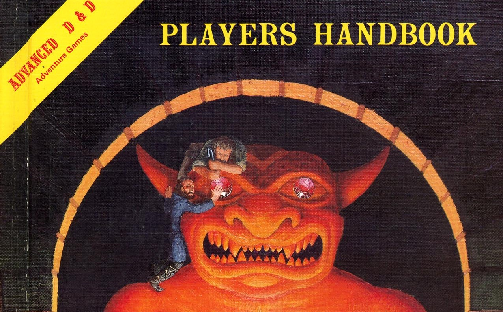

# Dragonbound

**Tags:**  #character #culture 

Dragonbound clans live under the direct rule of a dragon; in the case of dragonborn characters, that dragon will usually be their progenitor dragon. Whether that dragon is malevolent or benign, the clan exists to serve it. Living under a kind and wise dragon can be a safe and joyful upbringing, though one of strict control. Life under a cruel dragon can be fraught with the uncertainty of survival, scrounging off what a dragonic overlord deems a servant worthy of. Dragonbound living can often be comfortable or even enjoyable, but it is not living for oneself. Whether their chains are literal or metaphorical, dragonbound live at their master’s whims. Thankfully those whims often involve directives and missions that range far and wide, endeavors that expose dragonbound to countless viewpoints and quite often plant the seeds of sedition. Characters raised in the dragonbound culture share a variety of traits in common with one another. 

## Abilities
Skil, Tool, Advantage on check, utility

| Trait | Description |
| ----- | ----------- |
| Draconic Diplomacy | You’ve been well trained in the sometimes difficult art of draconic etiquette and protocols. You gain an expertise die on Charisma checks made to influence dragon creatures. |
| Dragonbound Teachings | You know one cantrip of your choice from the cleric or wizard spell lists. Your spellcasting ability for this cantrip is Intelligence or Wisdom (whichever is highest). |
| Progenitor’s Boon | Members of dragonbound clans overseen by their progenitors usually enjoy the benefits of their progenitor’s boon.  |
| Languages | You can speak, read, write, and sign Common and Draconic. |

Choose one of the following Dragonbound Boons below:

- **Chromatic Dragon’s Boon:** Chromatic dragons raise their warriors to shock and terrify their enemies. You can cast fear without the need for material components once per long rest. Until you reach 5th level, the area of this casting of the spell is limited to a 15-foot cone. Your spellcasting ability for this spell is Charisma.

- **Essence Dragon’s Boon:** Essence Dragons ensure that their guardians can easily commune with the land and the spirits within. You know the druidcraft cantrip. In addition, your diplomatic understanding extends towards the creatures of the land and the spirits within it. You gain an expertise die on Charisma checks made to influence beast and celestial creatures.

- **Gem Dragon’s Boon:** Gem dragons ensure their agents’ missions go undetected by bestowing upon them subterfuge magic. You know the message cantrip. Once you reach 3rd level, you can cast illusory script once per long rest. At 5th level, you can cast invisibility once per long rest. You don’t need material components for these spells, and when casting them your spellcasting ability is Intelligence or Charisma (whichever is highest).

## Related Links
- [Character Creation](../../20_character_creation.md)
- [Character Culture](../../23_character_culture.md)