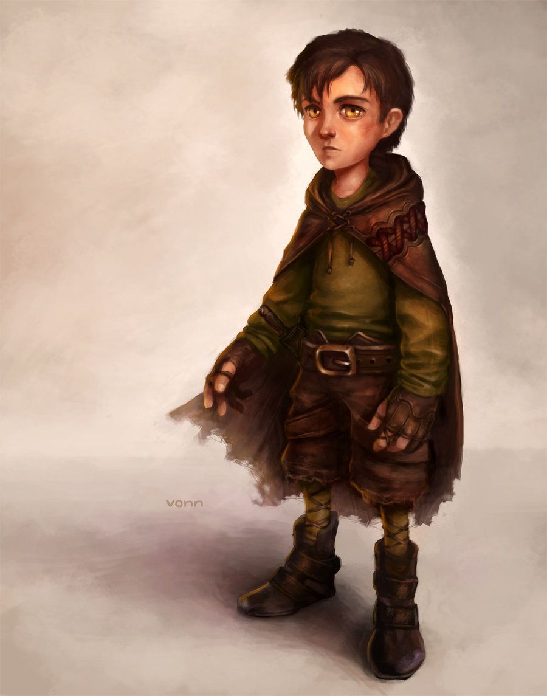

include::claude_duval.stats.adoc[]

[cols="2a,4a",grid=rows]
|===
|

| 
They wear neat and tidy clothing that is appropriate for their daily chores and activities at the orphanage. He takes pride in his appearance and tries to keep his clothing clean and in order. His shirts are likely long-sleeved and button-up, while his pants or skirts are plain and without any extra embellishments. Claude wears comfortable shoes for walking and working. They keeps their hair neatly combed.

Given that they are a well-behaved and obedient child who tries to please, it is possible that he has a few more possessions or items of higher quality than the other children in the orphanage. However, he would still be limited by the resources available at the orphanage, so his possessions would be relatively simple and functional.

Duval is a well-behaved and orderly child who is always trying to please the teachers and stay out of trouble. As such, he has developed a few mannerisms that reflect his meticulous and attentive nature:

    Duval constantly straightens his clothing and hair, making sure that everything is in its place.

    He often fidgets or clears his throat when he is nervous or trying to gain someone's attention.

    Duval is meticulous in his speech, making sure that his words are precise and well-spoken. He avoids using slang or informal language, even when speaking with other children.

    He has a tendency to hold his hands together in front of him when he is standing still, and will often clasp them behind his back when walking.

    Duval has a habit of standing up straight and looking directly at the person he is speaking to, making eye contact and showing respect for the conversation.

These mannerisms reflect Duval's desire to be seen as polite, responsible, and obedient, and help to reinforce his image as a model student in the eyes of the teachers and other authority figures at the orphanage.
|===