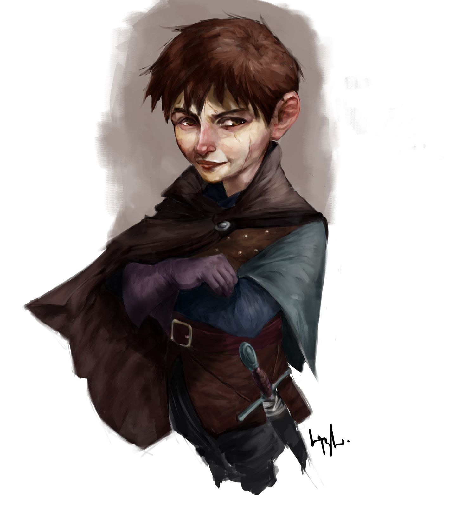

include::gilad_shams.stats.adoc[]

[cols="2a,4a",grid=rows]
|===
|

| 
Gilad Shams was abandoned at the orphanage at age 7, and since then, he has struggled to fit in. Over time, he developed a tendency to lash out at others and bully them. This behavior only worsened as he got older and stronger, and he became the most feared child in the orphanage.

Gilad often wears rough and worn clothes, with holes and stains that are evidence of his tough life at the orphanage. He doesn't care much about his appearance and just wants to be comfortable.

Despite his reputation as a bully, Gilad is deeply unhappy and resentful of the situation he finds himself in. He uses bullying as a way to assert control over others and make himself feel powerful. However, deep down, he is unhappy and longs for the love and acceptance that he never received as a child and the abandonment by his parents Ahmed and Farida Shams.

    Gilad has a tendency to slouch and look down when he walks, giving off a 'I do not care' demeanor.

    He often chews on his bottom lip when he's thinking, or when he's feeling anxious.

    Gilad has a habit of crossing his arms defensively over his chest when he's feeling threatened or defensive.

    He has a tendency to mumble or grumble under his breath, especially when things don't go his way.

    Gilad often avoids eye contact and looks away when someone is speaking to him, a sign of his discomfort and unease in social situations.

These mannerisms reflect Gilad's troubled past and the difficulties he has faced in life. He has learned to protect himself through aggression and bullying, but deep down he is insecure and uncertain about his place in the world.
|===
