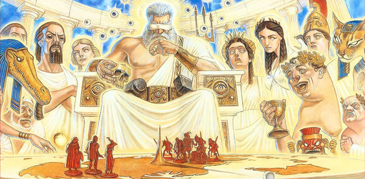

# 

# The House of Orphaned and Abandoned Offspring

# Ineffable Games

**Tags:** #public

The world was a vast and ancient place, shaped by the will of powerful beings beyond the comprehension of mortals. At the center of it all stood Mount Celstia, a towering peak that reached to the very heavens. It was there, atop that sacred mountain, that the Allfather gods Ranginui and Papatanuku resided. They were the creators of all that existed, the bringers of light and life to a world that would otherwise have remained forever in darkness.

Gods play games with the fates of men. The game they play is somewhere between Dungeons and Dragons, Risk and Chess, with Diplomacy, Monopoly and Battleships thrown in for good measure along the way. Don't think the game is complicated though; gods don't have the patience for complex games. They prefer games that are short and violent. The game is played on a map of the world that is, on closer inspection, the world itself. If you look closely enough at the tiny pin that is Mount Celestia in the middle of the board, you can see the gods on top of it in their home playing the game. If you look closer still, you can see the board with a tiny Mount Celestia.

A youthful deity is competing against all the other gods. Ranginui and Papatanuku observe the spectacle with a mixture of amusement, shame, and confusion. Ohm, their newest, is unique in that they are only a few thousand years old. Trusted upon them by the new arrivals on Atuaro. Ohm has resulted in upheaval both in the world and in the established traditions and customs of the gods themselved. Ohm glares at the game board, frustrated. "I was winning!". "What went wrong in the last few centuries?" Ohm stares at the board once more, hoping to find an edge ...

It's 5 AM on a early freezing spring morning. The window and heavy dark green curtains do little to keep out the cold. You try to snuggle under the blanket for warmth, but no matter how you arrange it, you can't seem to get comfortable. "I'm only 8 years old," you think. "This blanket nonsense has got to stop. I just need it to be longer." Suddenly, you sit up and open your eyes. You find yourself floating in a void of blackness and silence, and the cold is biting. No matter how you try to move, there is no resistance. You are suspended in the darkness, frozen in place.

A massive eye towers over you, its curiosity and threat palpable. The only thing in sight is the enormous purplish-brown iris, and your reflection appears as nothing more than a speck of dust. The pupil is black with a tiny blue dot in the center, and as you gaze at it, you feel judged and weighed. Overcome with fear and freezing cold, your eyes are fixed on the blue speck. As you fall into the pupil, you pick up speed, the blue dot growing larger. The coldness is replaced by warmth and then heat as your fear increases. The blue dot transforms into a world, with vast oceans encircling a huge continent surrounded by archipelagos and isolated islands.

From a distance, the massive continent and its vast oceans come into view. The continent boasts towering mountains and dividing rivers that create diverse landscapes. On the east side is a circular sea, a bay so large it appears as if a chunk has been bitten out of the continent. It is surrounded by expansive plains used for farming and woods that turn into jungles in the south. In the west lies a massive desert, a place so devoid of water that its inhabitants do not believe in rain. Far to the north, arctic conditions blanket everything in ice and snow. The central mountain range holds the abode of the gods, Mount Celestia.

You experience a rush of air and the world speeds towards you. The city of Loukotokia, a bustling entrepreneurial hub nicknamed the "Anthill," is quickly approaching. Built on several hills near one of the major rivers on the continent, it flashes by on your right as you continue your rapid descent to Kainga, a small village just a day's journey from Loukotokia.

Kainga is a compact and tidy village, surrounded by lush green forests and rolling hills. The town is built around a central square, where the Common House, the Temple of the Ohm, and the market stalls are located. The streets of Kainga are semi-maintained dirt roads, lined with wooden houses, barns, and workshops. To the north of the central square lies Tobias' Forge, a large, smoky building that doubles as the blacksmith's workshop and store. The river that runs near Kainga provides water for the town's crops and livestock, and also serves as a source of fish for the townspeople. The fertile lands around Kainga are dotted with small farms, where the town's residents grow crops, raise livestock, and live out their peaceful lives.

You head towards a notorious establishment on the outskirts of the village. Just as you would crash into the roof, you wake up, jolting upright and hitting your head on the ceiling or the upper bunk of your bed. Sweaty and hot, your bed is soaking wet. You are lying in your bunk in one of the bedrooms at the House of Orphaned and Abandoned Offspring.
