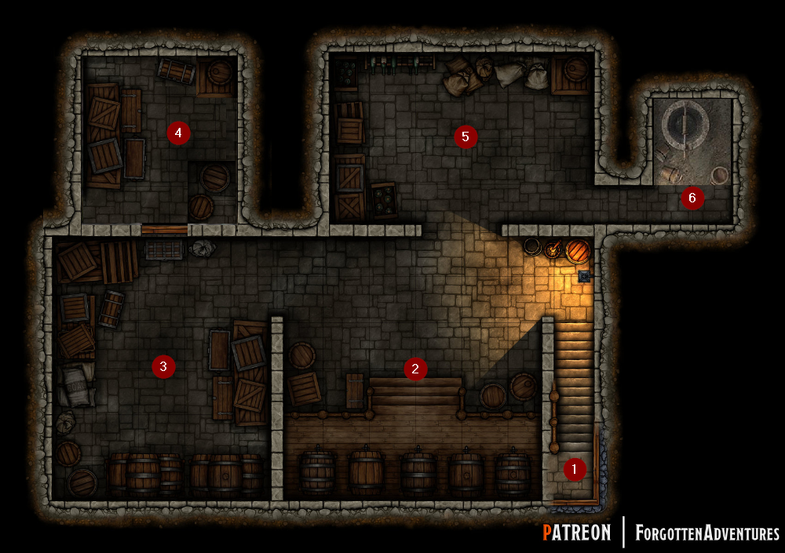

# The House of Orphaned and Abandoned Offspring

# Basement Dwellings

**Tags:** #adventure, #orphanage

## Summary
Ms Witchling will ask the characters to go in the basement to get refreshments for her guests that day. While in the basement they will have to fetch the drinks while avoiding the rats. If they investigate they will find a child locked up in the basement. There are some hidden valueables in that room if they can find them.

## The House of Orphaned and Abandoned Offspring
Kids with good behaviour get a Star. On the other hand if you mucked about you get a Bolt. Stars are awarded to the highest performing children. Any child who fails will receive a Bolt, without exception.
* Earning eleven Bolts results in immediate expulsion. Unlike you, Ms Witchling does not muck about. 
* A Star can be used to forgive a small trespassing if you play it off.
* You can use 2 Stars to get rid of 1 Bolt.

**A day at the House of Orphaned and Abandoned Offspring**

| Activity                   | Time           | Elders   |
| -------------------------- | -------------- | -------- |
| Hour of rising with chores | 6:00           |          |
| Hour of rising             | 6:30           |          |
| Breakfast until            | 7:00           |          |
| Work and lessons from      | 07:30 to 12:00 |          |
| Dinner from                | 12:00 to 13:00 |          |
| Work from                  | 13:00 to 18:00 |          |
| Supper from                | 18:00 to 19:00 |          |
| Recreation from            | 19:00 to 20:00 | to 21:00 |
| Bedtime at                 | 20:00          | at 21:00 |
| Lights out                 | 20:30          | at 21:30 |

**Tasks that need completion during the day**
The children get some lessons that learn them to read and write.
* Cleaning the orphanage
* Cleaning and lighting the fireplaces
* Laundry, making and mending clothes
* Oakum picking - hated by everyone
* Tending to the vegetable path and the animals
* Knitting clothes or spinning cotton

## Supporting characters
List of supporting characters in the orphanage.  

| Character        | Name           | Description                                                            | Link |
| ---------------- | -------------- | ---------------------------------------------------------------------- | ---- |
| The supervisor   | Ernsta Martell | The older offspring that tries to keep everying in order.              | [Link](npc/ernsta_martell_supervisor.md) |
| The Mother's Boy | Claude Duval   | The child that wants to do everything perfect and dislikes disruption. | [Link](npc/claude_duval_boy.md) |
| The Beauty       | Rufina Lo Duca | The child that thinks it is to pretty to work.                         | [Link](npc/rufina_lo_duca_beauty.md) |
| The Slacker      | Pasha Lebedev  | The child that will try to avoid doing actual work.                    | [Link](npc/pasha_lebedev_slacker.md) |
| The Weird One    | Aeria Jones    | The child well... you know a little bit weird?                         | [Link](npc/aeria_jones_weird.md) |
| The Bully        | Gilad Shams    | The kid that will bully the others.                                    | [Link](npc/gilad_shams_bully.md) |

## Breakfast

> The room is cramped and has a stale smell. You awaken from a restless sleep and realise that you are not the only one who has had a nightmare. The first bell rings at 6 AM and the assigned orphans rise from their beds, some still groggy, to wash up and get dressed. The girls are assigned to do the housekeeping tasks while the boys clean the fireplaces. 
> 
> The head mistress, Ms Witchling, a thiefling woman in her early forties, oversees the orphans with an iron hand, believing that she can save them from themselves through strict discipline. Her motto is "you can never start young enough" or "they will need to learn sometime, so why not now." The priority is that the tasks are completed to her satisfaction not on who did what.
>
> At 06:30 AM, all the other Offspring in the orphanage are required to rise from their beds and get ready for the day. This involves washing up and getting dressed. It is mandatory for everyone to have breakfast before 07:00 AM as this is the set schedule for starting the day. This strict routine is maintained by Ms Witchling, who runs the house with an iron hand. She believes that starting young and enforcing strict discipline is necessary to help the children grow into well-behaved and responsible individuals. 
>
> At 07:00 AM precisely, Ms Witchling sounds a bell and everyone falls silent, taking their place behind the table. She turns to you, "What's your name again? Oh well, never mind. Please lead the prayers this morning."

Allow for players to roll-play this out if they want. Choose a player that has to preside the prayer moment. Remind them Ohm is the god to pray to. Even if they would have a different god. She will berate the character no matter what. If the GM is very impressed by the roll-play you may give a Star if they muck about they get a Bolt.

## It is not a request
> Ms. Witchling reminds everyone of the guests arriving later that day and warns them to behave appropriately, reminding them of the consequences faced by Kenneth James McCormick. She then instructs someone to fetch two flagons of ale and wine, and to also one of water. *wait 2 seconds* What are you waiting for? Get on with it! An older offspring passes by "You seem flustered? Well hurry, the area is dark and there are rats" and then quickly leaves them to handle the task alone.

## Goal
1. Retrieve 3 flagons from the basement: 1 Beer, 1 wine, 1 water.
2. **SECRET** Save the child Timmy that is locked in room 4 by the bully Gilad.

## Blessings
In order to take one of the blessings they will need to convince a senior if they see them take it.

1. There is a lantern in the hallway
2. There are a big knife and meat cleaver in the kitchen
3. In the common room near the fireplace is a firepoke

## Obstacles
1. The house has 5 flagons for this purpose. Every time you break one. That is 1 Bolts for all characters. 

2. The basement is dark. Without the lantern found in the kitchen, they will not be able to see beyond the immediate vicinity of the stairs 5 ft.

3. There are rats in the basement.

    * Rats only attack if attacked first, the slightest provocation will do  
	* Holding full flagon? Athletics check for not tripping on rats.

4. Between room 2 and 3 there are cobwebs from spiders. The spiders are harmless. But if you get walk through them you become frightened and drop everything you are carrying. In room 5 on the right wall they can find an old broom to clear the cobwebs.

5. Save the boy (Timmy) from the locked storage room. The child will be scared of the other children. Find at least two of his 'attributes' to get him to come with you.

	* Players can easily find the items (no check needed, just the right action)  
	* His teddy can be found in room 2 (between some barrels)  
	* His blanket can be found in room 5 (middle on the floor to room 6)  
	* His small tin soldier toy is in room 3 (just behind the wall on the left)  

## Basement Map
  

**ROOM 1: STAIRS [DC-10]**

> A stone sturdy yet worn with time staircase leads you with each footstep deeper into the dark basement. The dim light filtering in from above casts a shadowy aura over the staircase.

* You need to hold the flagon's with 2 hands on the stairs. DEX check or drop the flagon.

**ROOM 2: KEGS [DC-10]**

> A basement room filled with wooden kegs of various sizes stacked up against the walls. The room is dark with a little dim light from the stairs

The children will need to use the spigots, which requires a strength check to open.

* 1d4 rats appear from the moment they enter the room.
* Timmy's teddy bear is between barrel 2 and 3.
* How are they going to know what is wine and beer?

Kegs 1 and 2 (3 leaves standing up), contain beer [PIA]  
Kegs 3 and 4 (3 circles upside down), contain wine [WAINA]    
Keg 5 (Circle with line, on/off symbol), contains apple cider [APORO]  

 
 

**ROOM 3: STORAGE [DC-10]**

> A dark storage area in the basement. The air is musty and damp, carrying with it the scent of old and forgotten things. Wooden crates and boxes are stacked haphazardly against the walls, leaving narrow aisles in between.

Once someone is close to the door for room 4:

> You hear a soft, pitiful whimper. A sound filled with fear, sadness, and desperation. The whimpering is constant but fluctuates in volume. You can see a shadowy figure sitting hunched on some boxes.

If they succeed on a perception check:

> You hear disorganised skittering and scrabbling of random and erratic movement of little paws.

This room contains old and worn clothes and cheap items required to run the orphanage.

* Entering the room they pass through cobwebs.

    The spiders are harmless. But if you get walk through them you become frightened and drop everything you are carrying. In room 5 on the right wall they can find an old broom to clear the cobwebs. CON SAVE.
  
* Save the boy from the locked storage room.

* Timmy's small tin soldier toy is in room 3 (just behind the wall on the left)

**ROOM 4: LOCKED ROOM [DC-11]**  

The door of the room:

> The door is sturdy and appears to be made of heavy wood. A wooden box is blocking the door from the outside.

The room itself:

> The storage room is small and cramped with a musty smell of dampness. The lack of light adds to the claustrophobic feel and increases the sense of being trapped.

This room contains clothes, pottery for longer term storage and the more expensive items.

* 1d4 rats are in the room (minimum 2)
* Timmy will not really respond but ask for his stuff
* Once Timmy has his stuff he will accompany the kids upstairs

**ROOM 5: STORAGE [CD-10]**

> This area of the basement is located near the stairs and is partially illuminated by its light. The dim light makes it difficult to see clearly, but you can make out the shapes of cluttered boxes and sacks, stacked haphazardly against the walls.

This room contains food, produce, grain. More expensive bottles of wine and beer. Candles.

* There is a broom near the right wall that can be used for the cobwebs.

**ROOM 6: WELL [DC-11]**

> This section contain a well surrounded by a stone wall. It provides fresh water for the orphanage. A sturdy wooden lid covers the top of the well, and a rope and bucket hang down into the depths. The walls of the well are slick and slippery, and the water in the depths is dark and still. The well is deep and narrow, and there is no light at the bottom, making it difficult to see what lies below. 

* They need to put the buck in, pull it up with water, and fill the flagon.

## Relevant Statblocks
### [RAT](../../world_compendium/beasts/rat.md) [HP 1, +0 hit, 1 piercing dmg]

| Speed | STR    | DEX     | CON    | INT    | WIS     | CHA    |
| ----- | ------ | ------- | ------ | ------ | ------- | ------ |
| 10 ft | 2 [-4] | 11 [+0] | 9 [-1] | 2 [-4] | 10 [+0] | 4 [-3] |

* Bite: Melee Weapon Attack: +0 to hit, reach 5 ft., one target. Hit: 1 piercing damage.  
* Proficiency 1d4, Darkvision 30 ft.
* advantage on smell Wisdom (Perception).
