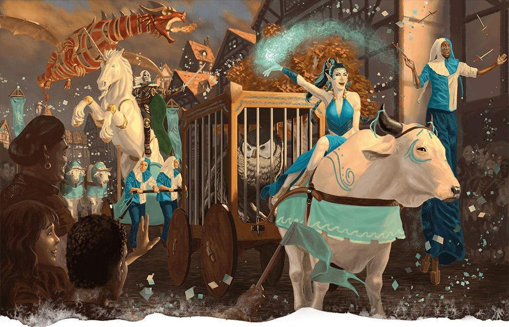

# The House of Orphaned and Abandoned Offspring

# The Imbolc Carnival

**Tags:** #adventure, #orphanage, #carnival

## Summary
The 11th day of Mahea [11/03/365 AR] is a lucky day. The Imbolc Carnival is in town. Ms Witchling made arrangements that allow the children to visit the carnival. The children heard from the older ones the exotic fruit is very special, but that Ms Witchling did not arrange a tasting. The children can go and visit the carnival, play the games, and maybe steal some of that fruit?

They have to find a treasury map that leads to the next encounter.

## Carnival
> The carnival is loud and boisterous, with music blaring, vendors shouting to attract customers, and carnival games being played. Musicians, dancers, and performers fill the streets, providing entertainment for the crowds that have gathered. Vendors sell an array of tasty treats, such as roasted meats, stews, bread, and sweet pastries. Children play games like tag, hopscotch, and leapfrog, while adults engage in games of chance and skill, such as archery, horseshoes, and chess.

## Goal 
1. Have fun at the carnival and try some of the games
1. Try to steal some of the exotic fruit
1. Run through the maze

## Blessings
1. At the welcome you receive 10 chips that allow you to participate or buy 1 single unit / item
1. NPC Mentor for druids: Willow Greenleaf (Herbalist)
1. NPC Mentor for warriors: Constable Emeric (police)
1. NPC Mentor for rogues: Magnifico the Magnificent (magician)
1. NPC Mentor for diviners of Ohm: Hibiscus Tauwi (Priest)

## Obstacles
1. There are 4 guards walking a beat, known as Tythingman. (~ local city guard for towns)

    - Constable Emeric (mentor for fighter and barbarian)
    - Tythingman Erevan (entrance)
    - Tythingman Kaelen (rounds)
    - Tythingman Aldric (sleeping)

1. One of the cages contains a bloody lot of young goblin minions

    | STR     | DEX      | CON     | INT     | WIS      | CHA    |
    | ------- | -------- | -------- | ------- | ------- | ------- |
    | 8 (−1) | 13 (+1) | 10 (+0) | 10 (+0) | 8 (−1) | 8 (−1) |
   
	They do 1 damage. If they take any damaged, they die.

## Carnival Maps
  
### Carnival Map

Rooms are numbered clockwise from the bottom left.

### Carnival Maze

### 01 - Welcome [DC10]
> The carnival entrance is marked by a grand archway, decorated with brightly coloured ribbons, flowers, and streamers. The archway towers over the entrance.

> Ms Witchling gathers the offspring and gives the each 10 tokens. "Have fun. It will be a while before something like this happens again. But I wanted to give you something as you have been behaving very well the last couple of months. Keep it up!" pointing to Gilad and Player [Antonio] "I told the guards about you! DO NOT LET ME DOWN!".

Tythingman Erevan is standing guard, salutes Ms Witchling and does not thrust the children.

Let the player make a deception check to see how well they can keep a straight face. Gilad the bully does without a hitch.

If they stay instead of running in they will hear the tythingman telling Ms Witchling about the treasury map the confiscated.

### 02 - Clown School [DC14]
> The walls of the tent are covered in colorful posters advertising different circus acts, and there are several small groups of people gathered around the different stations, watching the performers and practicing their own tricks. The air is filled with the sound of laughter and chatter as people share their successes and failures with each other.

There is a clown performing some basic acrobatic tricks which he is willing to learn to the audience.

If they succees the magician can tell them about the treasury map. He shares it as a joke because he does not believe it.

*DEX CHECK : Juggling*

    You juggle with 2 cones for [DC=8]
    Add 1 cone (3) for [DC=10]
    Add 1 cone (4) for [DC=12]
    Add 1 cone (5) for [DC=14] (Win 1 token)
    The clown lights them on fire for [DC=16] (Win 2 tokens)
    Failure to keep them up results in 1 fire/singe damage

### 03 - Maze
> The entrance of the maze made of haystacks is marked by two tall, imposing columns, each topped with a fake stuffed horse head. The columns are connected by a wooden arch, with the words "The Maze of Wonders" painted in bold, bright letters. The archway is draped with a garland of brightly colored flowers and ribbons, creating a festive and inviting atmosphere.

> Looking better as you step closer to the entrance, you notice that the hay bales making up the walls of the maze have been badly arranged and not as stable as it should be.

The moment they enter the maze the goblins escape. Yes: it was Galid but he made sure nobody knows. Some of the goblins come to hide in the maze. Will attack when they feel threathened.

Goblins have 1 HP and deal 1 DMG when they attack. 

*NPC: Gormack Labirini*
The maze runner is a lanky, unkempt man in his mid-twenties. His shaggy brown hair falls haphazardly over his forehead, and he has a scruffy beard that looks like it hasn't been properly groomed in weeks. He wears a stained and tattered green tunic that hangs loosely on his thin frame, and his baggy trousers are held up by a frayed rope belt.

### 04 - Magic Show
> As the players approach the tent, they see a sign that reads "The Amazing Magnifico - Master of Magic!" Inside the tent, they see a middle-aged man wearing a top hat and cape, performing various magic tricks using various implements.

The tent where Magnifico performs is brightly colored, with colorful streamers and posters of his magic tricks lining the walls. The atmosphere is lively, with people laughing and applauding as they watch his performance.

If they succees the magician can tell them about the treasury map. He shares it as a joke because he does not believe it.

*WIS CHECK*  
Magnifico performs a trick where he shuffles a ball under three cups, and the players must guess which cup the ball is under. After several attempts, the players realize that Magnifico is using slight of hand to manipulate the cups and ball, and they manage to catch him in the act. Impressed by their skills, Magnifico decides to teach them the trick and a few other slight of hand techniques. He reveals that he used to be a thief, but he gave up his life of crime after discovering the joy of entertaining people with his magic tricks.

*NPC: Magnifico the Magnificent*
Magnifico himself is a charming and flamboyant character, with a big personality and a love for entertaining people. He is always looking for new tricks to perform and new audiences to amaze. He greets them with a big smile and introduces himself as Magnifico. He offers to teach them one of his tricks for a small fee. However, the catch is that they must figure out how he did it themselves.

### 05 - Pie eating contest
> A stage is set up for the presenter to entertain the crowd and the area is lined with tables and chairs where contestants sit and wait for the signal to start. The pies are lined up in front of them, steaming hot and smelling delicious.

> "Welcome, welcome, one and all to the grandest pie eating contest in all the land!" Barnaby announces, his voice booming across the area. "We've got pies, we've got contestants, and we've got the best audience in the world!" 

> As the contestants prepare to start, Barnaby continues to hype up the crowd. "These brave souls are about to put their stomachs to the test!" he exclaims. "Who will emerge victorious and claim the title of Pie Eating Champion? Only time will tell!"

> Throughout the contest, Barnaby continues to provide colorful commentary and witty remarks. "That's it, folks, we've got a real slobberknocker on our hands!" he shouts as two contestants go head to head. "Who will be the first to succumb to the pie-induced food coma?"

> At the end of the contest, Barnaby crowns the winner with a grand flourish. "Ladies and gentlemen, we have a winner!" he declares. "Let's give it up for the newest member of the Pie Eating Hall of Fame!"

*CON CHECK*
Exceeding CON checks +2 until there are no more participants. Start with [DC8].
Winner gets carnival token.

*NPC: Barnaby*
The presenter, a flamboyant and enthusiastic man named Barnaby, is dressed in a colorful suit and top hat. He speaks into a microphone and addresses the crowd, building up excitement for the contest.

### 06 - Displace Beast Ride
> The displacer beast is a magical creature resembling a large, sleek panther with six legs and two tentacles protruding from its shoulders. The ring is a large, circular enclosure made of rough-hewn wood, with high walls to keep the bull contained.

> As the bull riding contest begins, Bofur pumps up the crowd with his booming voice, shouting out quotes like:
>  
>    "Are you ready for the ride of your life? This ain't no pony ride, folks!"  
>    "This bull's got more moves than a drunken dwarf on a dance floor!"  
>    "Let's see if our riders have what it takes to tame the beast!"  
>    "Hang on tight, folks, it's gonna be a bumpy ride!"  
>    "Who will be the last one standing? The bull or the brave dwarves who dare to ride it?"  

*STR CHECK*
Keep making an DC14 strenght check to stay on the bull.
If you fall of make a DC10 strength check to make certain you do get damaged.
Stay on the bull the longest? Token.

*NPC: Bofur*
He is loud and boisterous dwarf. He wears a bright red vest with gold buttons and a black bowler hat that sits atop his curly red hair. He carries a whip and a megaphone as he struts around the ring, announcing the upcoming riders and revving up the crowd.

### -7- Open Podium [DC10]
> The open podium allows everyone can join and perform to be star!

*CHAR CHECK*
A contest to win the hearts of the people. Either against each other or alone.
Beat a 10 and keep the score going higher. The moment you fail the DC people boo you.
Otherwise, drop the score to low and the people will just leave or another person will try to push you of the stage to get their turn.
Winner gets 1 extra ability score point to distribute and a coin for an attraction.

Some bad jokes the other NPC can give
- Difference between hurricane and marriage. At first there is a lot of sucking and blowing, and then you loose the house!
- Why did the scarecrow win an award? Because he was outstanding in his field!
- What do you call a fake noodle? An impasta!
- Singing a silly song about a talking dog who loves to dance
- "I met a man who told me he had a job pouring cream into tiny cups. I said, 'Is that all you do?' He said, 'No, but I'm a whisk taker.'"
- "Why don't scientists trust atoms? Because they make up everything!"
- "Knock knock." "Who's there?" "Boo." "Boo who?" "Don't cry, it's just a joke!"
- "I have a joke about construction, but I'm still working on that one."
- "Why was the math book sad? Because it had too many problems."
- Singing a silly song about a farmer who grows giant vegetables, but can't seem to find a market for them.
- "Why did the tomato turn red? Because it saw the salad dressing!"

### -8- Animal Exhibit
> The cage full of young goblins is a smaller, more cramped enclosure. The goblins are squabbling and bickering amongst themselves, and occasionally snatching food from one another. Despite their small size and seemingly harmless demeanour, goblins are notoriously vicious and cunning creatures, and many have fallen victim to their ambushes and traps.
>
> The second cage in the tent of animals at the carnival contains a fierce and ferocious displacer beast, a powerful feline predator with six tentacle-like appendages that protrude from its shoulders.
>
>The cage of the owlbear is a large, sturdy wooden structure with thick metal bars. The bars are spaced closely together to prevent the owlbear from squeezing through, and the door is secured with a heavy padlock. Inside the cage, there is a large pile of straw for the owlbear to sleep on, and a shallow bowl of water in the corner. The owlbear itself is a fearsome creature with sharp claws and a powerful beak, and it paces back and forth restlessly in its cage, occasionally letting out a menacing growl.

If they are pleasent to him and can guess the number of goblins, he will share the secret of the treasury map.
He heard the guards talking to each other.

If they come to close the animal will try to bite attack for 1 damage.

*INT CHECK*
Guess how many goblins are in the cage.
Throw higher then 18 you know the exact number. The highest number wins.
Winner gets 1 extra ability score point to distribute and a coin for an attraction.

*NPC: Zephyrion Nightshade*
Owner is a flamboyant and eccentric half-elf named Zephyrion Nightshade. He dresses in garish and ostentatious clothing, adorned with feathers, beads, and other exotic trinkets. His long hair is dyed a bright blue, and his ears are pierced with multiple rings and studs. Zephyrion is a consummate showman, and he regales passersby with tales of his travels to distant lands in search of rare and exotic creatures.

### -9-: Guard Room [DC12]

> The Tythingman's tent is a functional and utilitarian space, designed to provide a base of operations. It is made of durable canvas and supported by wooden poles. Inside the tent, there is a simple wooden table with a few chairs, where the Tythingman and his assistants can sit and keep an eye on the comings and goings of the carnival. There is also a small bedroll in one corner of the tent, where the Tythingman can rest during his long shifts. There seems to be a map on the table that looks like a treasure map.

One of the Tythingman is sleeping on the bedrol. Fail a stealthcheck to awaken him. If other guards see you enter they will call out to leave the place alone. Inside there is a short sword, shield, dagger, and a spear. And a set of cloth armor.
The treasury map is on the table.

### Central Market square [DC10]

> The center of the carnival is a bustling marketplace where vendors have set up colourful stalls to sell their wares. The stalls are arranged in neat rows, each one adorned with bright banners and flags that flap in the breeze. The smell of cooking food wafts through the air, mingling with the sounds of laughter, music, and chatter. The vendors are a diverse group, selling everything from fresh produce to handmade crafts, clothing, and trinkets. Their wares are displayed in colourful arrays, catching the eye of passersby with their vibrant hues and intricate designs.

Their are various vendors who work on the small market.

    Herbalist - Willow Greenleaf --> Can be mentor for a druid

    Baker - Roland Crust
    Jeweler - Aria Gemstone
    Blacksmith - Magnus Ironheart
    Cloth Merchant - Felicity Silkweaver
    Potion Maker - Ambrosia Nightshade
    Leatherworker - Gideon Tannery
    Book Seller - Edgar Tomekeeper
    Toy Maker - Gwendolyn Playful
    Wine Merchant - Luciano Vino

## Extra
During the Dark Ages of Europe, which lasted from the 5th to the 10th century, the seasonal transition from winter to spring was often referred to as "Candlemas" or "Imbolc". Candlemas was celebrated on February 2nd and marked the halfway point between the winter solstice and the spring equinox. Imbolc was a Gaelic festival celebrated on the first day of February and marked the beginning of spring in Ireland and Scotland. Both of these festivals celebrated the end of winter and the beginning of the agricultural season.
