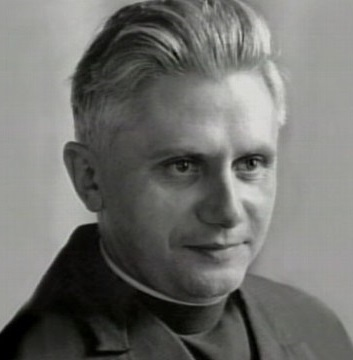

# Hibiscus Tauwi aka The Priest [NPC]

## Statistics
Race: Human
Class: Cleric
Level: 6
Age: Early thirties
Alignment: Lawful Good

**Attributes**

	Strength: 10 (+0)
	Dexterity: 10 (+0)
	Constitution: 14 (+2)
	Intelligence: 13 (+1)
	Wisdom: 16 (+3)
	Charisma: 14 (+2)

**Common Items**

	He has a holy symbol of his Ohm around on a silver chain and wheres refined priest clothes. Usually carries the book of Ohm on his person.

	Has a small pouch containing 5 gold pieces and 10 silver pieces. He is generous towards the town as the town is generous in church.

**Special Abilities**

	**Divine Guidance**: Hibiscus is a devout cleric of his deity and believes the words of his god and can make you believe them within his aura of 30 ft. That is why he likes standing between his people during mass. You want to believe. The feeling goes away the moment you leave the aura.

	**Inspiring Presence**: Father Tauwi's spiritual leadership inspires those around him to greater heights. Whenever he successfully persuades a creature to take a specific course of action or makes a convincing argument in a debate, you follow what he said even after leaving his aura. It takes longer to find your own opinion afterwards.

	** Repent! Confess! **: People feel feel compelled to confess any small secrets or misdeeds they have committed. While this ability does not force a creature to reveal major secrets or information they wish to keep hidden, Father Hibiscus does know how to use the information he learns from confessions to his advantage. Mostly to advance his carreer.

## About
Hibiscus is a young and handsome man with piercing blue eyes, a chiselled jawline, and a head of thick blonde hair that he keeps trimmed short. He wears simple and unadorned clerical robes, which are always impeccably clean and well-pressed.

Father Tauwi came to Kainga several years ago after an incident in Loukotokia. He is eager to make a name for himself and restore his reputation in the clergy. He is ambitious, driven, and devoutly religious. He has a secret that he has been keeping hidden for many years. He had an illicit affair with a woman, which resulted in the birth of a child. Fearing that a child would tarnish his career in the clergy, he gave the infant to the House of Orphaned and Abandoned Offspring, run by Ms. Witchling in Kainga. Seeing the community had no real spiritual leader he remained in the community as he saw it as way to regain his lost stature.

Ms. Witchling suspects that one of her 'offspring' is Father Hibiscus Tauwi's child, but she keeps this information to herself out of respect for the priest's position in the community. The Father, for his part, is entirely focused on his career and has never shown any interest in the child or in pursuing / rekindling a relationship with the mother. The priest knows about th e mayor Cedric Oakheart's romantic interest in Ms. Witchling.