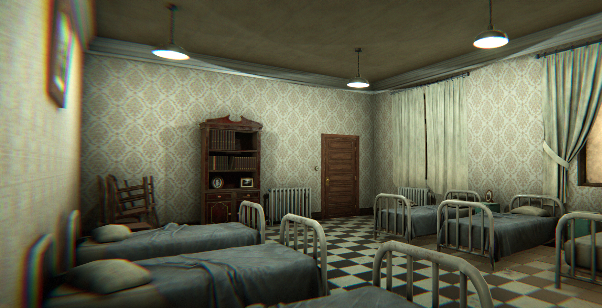

# The House of Orphaned and Abondoned Offspring
# Part 1: Introduction and character creation
## Welcome
Hi everyone and welcome to the session zero of your Atuaro adventure.

Just a reminder that in the Player Handbook you can find a lot of interesting things like:
* [Basic Play](../../articles/handbook/02_basic_play.md)
* [Table Rules](../../articles/handbook/03_table_rules.md)
* [Game Rules](../../articles/handbook/04_game_rules.md)

As mentioned in the Table Rules, I expect that you have a way of managing your character. The obvious ways is using a form fillable PDF or one of the many D&D character apps that are available. A few examples are the [Standard Character Sheet](https://drive.google.com/file/d/1sjd2aDPNjKsBiKrbSLNv6KX7_U9weaHz/view?usp=sharin) or an [Alternative Character Sheet](https://drive.google.com/file/d/1EIMu3GcUxLUxFd7azWe0p9HaiNTEB6t1/view?usp=sharing). My personal preference is that you no longer use D&D Beyond in light of the O.G.L. controversy. An editable PDF, World Anvil, VTT has a good player character manager my preference would be one of these.

## Ineffable Games
The world was a vast and ancient place, shaped by the will of powerful beings beyond the comprehension of mortals. At the center of it all stood Mount Celstia, a towering peak that reached to the very heavens. It was there, atop that sacred mountain, that the Allfather gods Ranginui and Papatanuku resided. They were the creators of all that existed, the bringers of light and life to a world that would otherwise have remained forever in darkness.

Gods, of course, play games with the fates of men. The game they play is somewhere between Dungeons and Dragons, Risk and Chess, with Diplomacy, Monopoly and Battleships thrown in for good measure along the way. Don't think the game is complicated though; gods don't have the patience for complex games. They prefer games that are short and violent. The game is played on a map of the world that is, on closer inspection, the world itself. If you look closely enough at the tiny pin that is Mount Celestia in the middle of the board, you can see the gods on top of it in their home playing the game. If you look closer still, you can see the board with a tiny Mount Celestia.

A youthful deity is competing against all the other gods. Ranginui and Papatanuku observe the spectacle with a mixture of amusement, shame, and confusion. Ohm, the newest of the gods, is unique in that it is only a few thousand years old and it shows in its behavior. Trusted upon them by the new arrivals on Atuaro. Ohm has resulted in upheaval both in the world and in the established traditions and customs of the gods themselved. Ohm glares at the game board, frustrated. "I was winning!". "A thousand years ago, no one would have dared to say I wouldn't win. What went wrong in the last few centuries?" "I hate them all! These gods! This new world!" Ohm stares at the board once more, hoping to find an ... edge ...

It's 5 AM on a early freezing spring morning. The window and heavy dark green curtains do little to keep out the cold. You try to snuggle under the blanket for warmth, but no matter how you arrange it, you can't seem to get comfortable. "I'm only 8 years old," you think. "This blanket nonsense has got to stop. I just need it to be longer." Suddenly, you sit up and open your eyes. You find yourself floating in a void of blackness and silence, and the cold is biting. No matter how you try to move, there is no resistance. You are suspended in the darkness, frozen in place.

A massive eye towers over you, its curiosity and threat palpable. The only thing in sight is the enormous purplish-brown iris, and your reflection appears as nothing more than a speck of dust. The pupil is black with a tiny blue dot in the center, and as you gaze at it, you feel judged and weighed. Overcome with fear and freezing cold, your eyes are fixed on the blue speck. As you fall into the pupil, you pick up speed, the blue dot growing larger. The coldness is replaced by warmth and then heat as your fear increases. The blue dot transforms into a world, with vast oceans encircling a huge continent surrounded by archipelagos and isolated islands.

From a distance, the massive continent and its vast oceans come into view. The continent boasts towering mountains and dividing rivers that create diverse landscapes. On the east side is a circular sea, a bay so large it appears as if a chunk has been bitten out of the continent. It is surrounded by expansive plains used for farming and woods that turn into jungles in the south. In the west lies a massive desert, a place so devoid of water that its inhabitants do not believe in rain. Far to the north, arctic conditions blanket everything in ice and snow. The central mountain range holds the abode of the gods, Mount Celestia.

You experience a rush of air and the world speeds towards you. The city of Loukotokia, a bustling entrepreneurial hub nicknamed the "Anthill," is quickly approaching. Built on several hills near one of the major rivers on the continent, it flashes by on your right as you continue your rapid descent to Kainga, a small village just a day's journey from Loukotokia.

Kainga is a compact and tidy village, surrounded by lush green forests and rolling hills. The town is built around a central square, where the Common House, the Temple of the Ohm, and the market stalls are located. The streets ofKainga are semi-maintained dirt roads, lined with wooden houses, barns, and workshops. To the north of the central square lies Tobias' Forge, a large, smoky building that doubles as the blacksmith's workshop and store. The river that runs near Kainga provides water for the town's crops and livestock, and also serves as a source of fish for the townspeople. The fertile lands around Willowdale are dotted with small farms, where the town's residents grow crops, raise livestock, and live out their peaceful lives.

 You head towards a notorious establishment on the outskirts of the village. Just as you would crash into the roof, you wake up, jolting upright and hitting your head on the ceiling or the upper bunk of your bed. Sweaty and hot, your bed is soaking wet. You are lying in your bunk in one of the bedrooms at the House of Orphaned and Abandoned Offspring.

## Character Creation
To play in a role-playing game you will need a character. But as most players already did this plenty we are going to condense the information to what you need to know to play in Atuaro with links to relevant articles if you want to know more. As we are building a random generated character do not feel to fixated on your choices. People change with age. [Read More.](../../articles/handbook/05_character_creation.md)

Please create 3 characters in order and set their
* Ability Scores
* Character Lineage
* Class Archetype
* Hit Points
* Basic Information

### Ability Scores
The first order of business is to create our [Ability Scores](../../articles/handbook/07_character_abilities.md). Please use the Hardcore Mode to create your ability scores. For each ability score:

> * In order from STRength to CHArisma
> * Roll 3D6 ONCE in ORDER and note the result
> * Keep track of the lowest die roll
> * Calculate your standard modifier
> * Subtract the lowest die role

### Character Lineage
Characters in the world belong to a lineage which includes certain biological characteristics and defines some aspects of their physical appearance. Other things, such as a character’s speed and size, are also derived from their lineage.

> Choose one of the playable races from the Atuaro handbook

If you wish to add a race please talk to your GM.

### Class Archetype
Select one of the class archetypes.

> * Martial, a character that martial prowess
> * Diviner, a character that gets its power from the gods
> * Mage, a character that uses arcane magic 
> * Expert, a character with special expertise

### Hit Points
At level zero, your character has 1 D4 Hit Die. Later the die type is determined by your class. At each Level, roll your class Hit Die and add that to your MAX HP. No CON modifier applies, no re-rolls, no max outcomes.

### Basic Information
Please answer the following questions?
* How long have you been at the Witchling House?
* Were you brought here as a newly born?
* Or yesterday by your parents or their servant?
* Do you know why they brought you here?

Is there anything you would like to add?
* Personality traits
* Ideals, bonds, flaws
* A hobby, personal item from your past?
