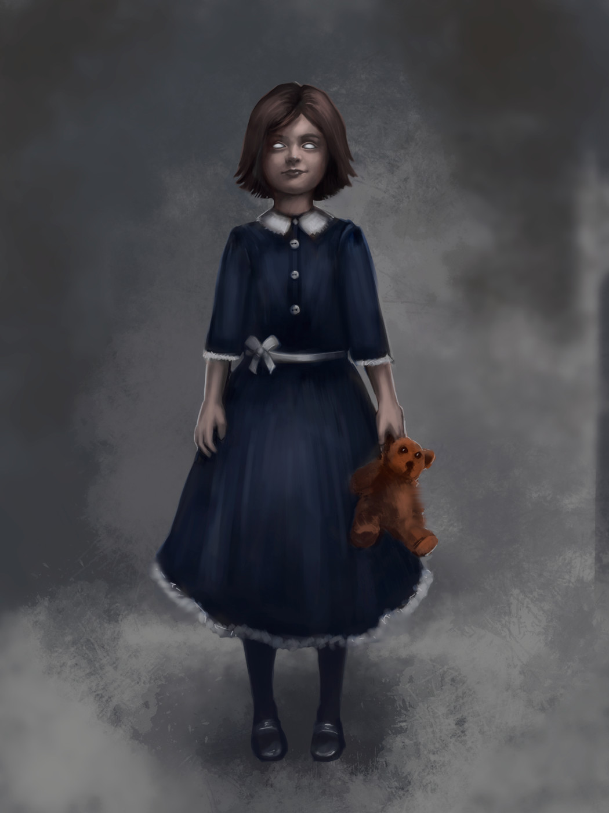

# Aeria Duval aka The The Weird One [NPC]

## Statistics
Race: Human
Class: Commoner
Alignment: Chaotic Neutral
Age: 9

Attributes:

    Strength: 8 [-2]
    Dexterity: 7 [-3]
    Constitution: 9 [-1]
    Intelligence: 11 [+1]
    Wisdom: 9 [-1]
    Charisma: 8 [-2]

Common Items:
    
    Usually some weird common item on her person
    A partial deck of tarrot cards

Special Abilities:

    **Eccentric Personality**: Aeria has an eccentric personality that often makes her behave in strange and unpredictable ways.

    **Keen Senses**: Aeria has keen senses, which can make her aware of things that others might miss.

    **Aloof**: Aeria tends to keep to herself and is often aloof, which can sometimes make others uncomfortable around her.

## About
Aeria Jones is 9 years old and considered "weird" by the other children in the orphanage. They carry around unusual or seemingly random items with her such as a rocks or sticks. They carry a partial deck of tarot cards. She uses them to tell the future. And many children swear she has a pet rat. She could also have mannerisms that set her apart, such as talking to herself, muttering under her breath, or constantly fidgeting with her hands. These behaviors might make the other children uncomfortable and avoid her, further isolating Aeria and reinforcing her unusual behavior.

Aeria was always a little bit different from the other children in the orphanage. Her behavior often made others uncomfortable, and as a result, she was often avoided. Despite this, Aeria is a curious and intelligent child who has a love for the strange and unusual.