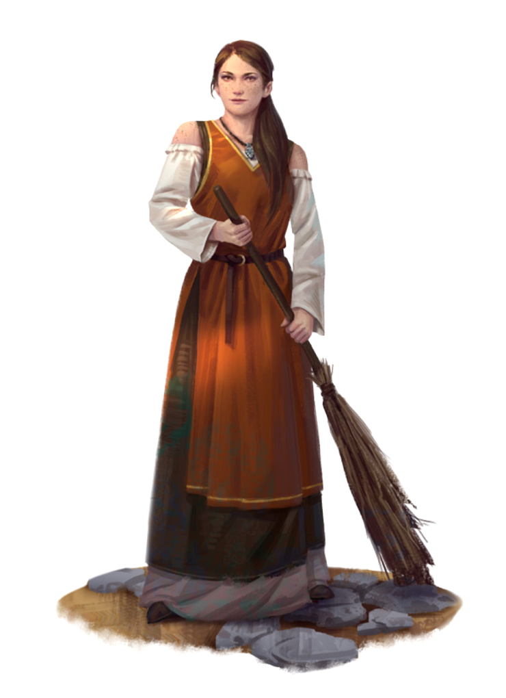

# Ernsta Martell aka The Supervisor [NPC]
## Statistics
Race: Human  
Class: Commoner  
Alignment: Lawful Good
Age: 14

Attributes:

    Strength: 9 [-1]
    Dexterity: 9 [-1]
    Constitution: 9 [-1]
    Intelligence: 11 [+1]
    Wisdom: 12 [+2]
    Charisma: 10 [+0]

Common Items:

    One common household item.
    They have a 1d8 copper pieces and 1d4 silver.

Special Abilities:

    **Leadership**: A natural talent for leadership and can inspire and motivate others to work together towards a common goal. 

    **Empathy**: A deep understanding of other people's feelings and emotions and can easily connect with others.

    **Wisdom**: Wise beyond their years and has a good understanding of right and wrong.

## About
They are wiser beyond their years and have a natural leadership quality. They have a strong sense of justice and will not tolerate bullying or mistreatment of the younger children in the orphanage if she sees it.

They wear simple, sturdy clothing that is appropriate for their daily chores and activities at the orphanage. Likely has a few different outfits, all of which are plain and functional, made of cotton or a similar material. Shirts are long-sleeved and button-up, while her pants or skirts are plain and without any extra embellishments. They wears comfortable shoes for walking and working. Most of their items are worn out.

Being an older and more experienced member of the orphanage, has a bit more freedom and confidence than some of the younger children. Her mannerisms reflect this, as well as her kind and nurturing nature:

    Martell has a tendency to run their fingers through their hair when they are thinking, or when they are trying to calm themselfs down.

    They often have a gentle smile on their face, and is quick to offer a comforting touch or hug to anyone in need.

    Martell has a tendency to use gentle gestures when speaking, such as placing a hand on someone's shoulder or arm to make them feel at ease.

    Martell has a habit of tilting their head to the side when they are listening to someone, showing that they are paying attention and truly caring about what they have to say.

    Martell is often seen humming or singing softly to themself, a habit that brings them comfort and peace, especially in stressful or trying situations.

These mannerisms show that Martell is a warm, compassionate, and nurturing person who takes her role as a caretaker at the orphanage seriously. Despite the challenges she faces, she remains optimistic and always seeks to bring happiness and comfort to those around her.