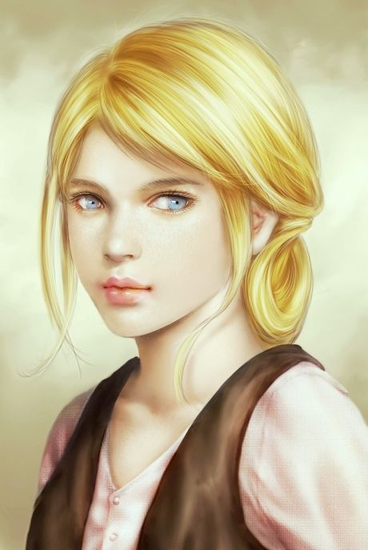

# Rufina Lo Duca aka The Beauty  [NPC]

## Statistics
Race: Human
Class: Commoner
Alignment: Chaotic Neutral
Age: 11

Attributes:

    Strength: 7 [-3]
    Dexterity: 8 [-2]
    Constitution: 8 [-2]
    Intelligence: 9 [-1]
    Wisdom: 9 [-1]
    Charisma: 11 [+1]

Common Items:
    
    Has a single really nice item that they use to accentuate their beauty.

Special Abilities:

    **Charm**: Rufino/a's good looks and charisma makes them very likable, which can be a useful tool when dealing with others.

    **Vanity**: Rufino/a is very vain and can be easily distracted by their own appearance, which can be a hindrance in certain situations.

    **Negotiation**: Rufina is a skilled negotiator and can use their charisma to their advantage in negotiations.

## About
Believing they are too pretty to work, they might carry items that enhance her appearance, such as a comb. Could also have mannerisms that reflect her confidence and self-importance, such as striking poses, preening in front of mirrors, or tossing their hair. May also pout or throw tantrums when things don't go her way.

    Constantly admiring herself in mirrors or reflective surfaces
    Pouting when she doesn't get her way
    Tossing her hair dramatically
    Strikng poses and preening for attention
    Flipping her hair when speaking to others
    Fussing with her clothes and appearance constantly
    Whining or throwing tantrums when things don't go her way.

These mannerisms reflect Lo Duca's confidence and belief that they are too pretty to do any real work, which might make her come across as entitled or vain to others. Will choose the 'nice' jobs to avoid any real work.
