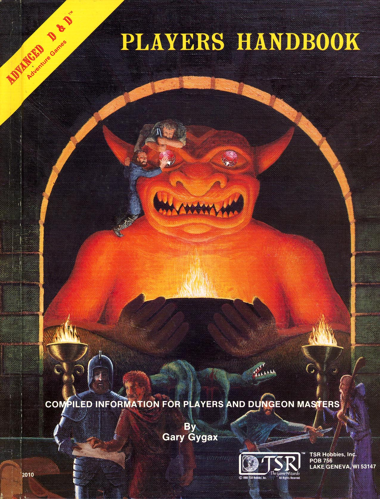

# Introduction Lineages
Characters in the world belong to a lineage which includes certain biological characteristics and defines some aspects of their physical appearance. Other things, such as a character’s speed and size, are also derived from their lineage. While a heritage may be a factor in your character’s story, that’s just the beginning. Who they are is defined by the experiences and the actions that lead them to where they are now.

Each lineage gets a feature, a gift, and a paragon feature at certain levels. These levels are determined by the DM but by default are:
* Lineage Feature is at Level 1 or DM choice.
* Lineage Gift is at Level 4 or DM choice.
* Lineage Paragon is at Level 4 or DM choice.

| Lineage | Description | Link |
| ------- | ----------- | ---- |
| Ardling Lineage | The one with the angel wings | [Link](./ardling.md) |
| Dragonborn Lineage | The one that looks like a dragon | [Link](./dragonborn.md) |
| Dwarven Lineage | The tough bearded one of small stature | [Link](./dwarf.md) |
| Elven Lineage | The one with pointy ears | [Link](./elf.md) |
| Gnomish Lineage | The really short happy fellow | [Link](./gnome.md) |
| Hobbit Lineage | The shire, meadows, the fair life one | [Link](./hobbit.md) |
| Human Lineage | The standard | [Link](./human.md) |
| Tiefling Lineage | The one with the devil horns | [Link](./tiefling.md) |
| | |
