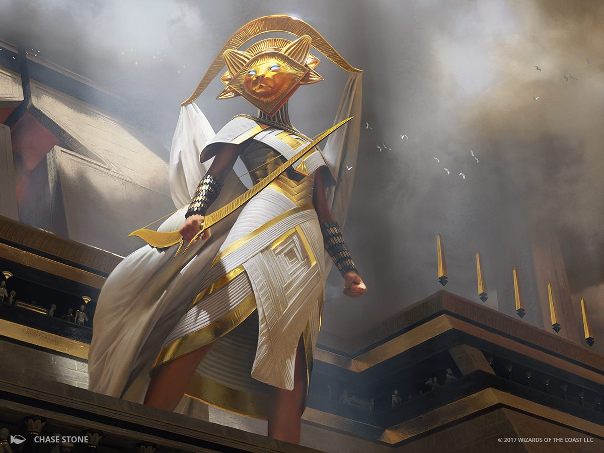

# Ardlings
Ardlings are supernal beings who are either born on the Upper Planes or have one or more ancestors who originated there. Their bright souls shine with the light of immortal beings who call the Upper Planes home. An ardling has a head resembling that of an animal, typically one with virtuous associations. Depending on the animal, the ardling might also have soft fur, downy feathers, or supple bare skin. The ardling’s celestial legacy determines the animal it resembles. An ardling gains a measure of magical power from their celestial legacy, as well as the ability to	manifest spectral wings.

## Attributes

| Attribute | Description |
| --------- | ----------- |
| Lifespan | Up to 200 years, mature at 20, 150 is old |
| Height | Base 4 ft 5 in [2d8]; 5 - 7 ft avg; Medium |
| Weight | Base 75 lb [2d4]; 100 lb avg |
| Languages | Celestial, common |
| Speed     | 30 ft |
| Angelic Lineage | Lineage damage: radiant  Prof mod / day you can  prout spectral wings.  Half prof mod / day Lineage spells:   - Feather fall (if wings deployed)   - Guidance
| Angelic Resistance | Lineage damage ignores radiant resistance Extra lineage spells: - Levitate (if wings deployed) - Devine favor |
| Angelic Immunity | Lineage damage uses immunity as resistance Extra lineage spells:  - Fly (if wings deployed) - Zone of thruth
|  |  |

## About
Ardlings have been born with a supernatural bloodline from the heavenly plane. Their souls shine bright with an immortal light. You can sprout spectral wings. An ardling has a head resembling that of an animal, typically one with virtuous associations.

They have a lot in common with Tieflings with that they are the complete opposite. They lack a homeland so they know that they have to make their own way in the world. They are thrusting by nature as the are looked upon as angels by the other lineages.

Ardlings are usually loved and thrusted by the other lineages. By virtue of their celestial legacies, some ardlings strive to make the world a better place. People mirror their supernal gifts to be the  best version of themselves.
