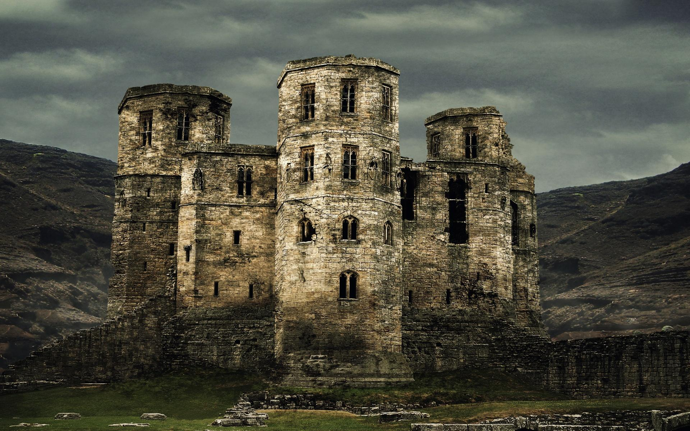
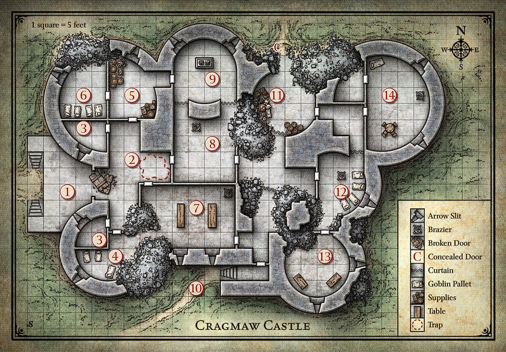

= Lost Mines of Kainga: Cragaw Castle
:toc:

*Tags:* #lostmines

[align=center]

== Summary

The Cragmaw tribe consists of marauding bands and rival goblinholds scattered throughout the area. However, tne chieftain is grudgingly recognized by all others as supreme: King Grol of Cragrnaw Castle. Cragmaw Castle is not a goblin construction, nor is that the structure's original name. Raised by a talented wizard-noble of old Loukotokia, an ancient realm that once controlled much of the North, the stronghold consists of seven overlapping towers; however, its upper levels have long since collapsed to heaps of crumbling masonry. Only the ground floor is still sound enough to be habitable.

== General Features

The centuries have not been kind to Cragmaw Castle. The goblins have shored up the weakest areas beneath its falling towers with crude timbers, but it's only a matter of time before the structure collapses completely. +
*Ceilings.* Ceilings are 15 feet high unless noted otherwise. +
*Doors.* Interior doors are made of wood reinforced with iron bands. They have neither locks nor keyholes. It takes a successful DC 15 Strength check to break down a doorthat is barricaded shut. +
*Floors.* Cracked and uneven flagstones conceal a dirt floor underneath. +
*Light.* A small amount of natural light filters through the arrow slits around the castle. During the day, this provides dim light in most areas. At night, all areas are dark. +
*Walls.* Exterior walls and load-bearing interior walls are 5 feet thick, with 3 feet of mortared fill sandwiched between 1-foot-thick courses of hard stone blocks. +
*Interior* walls are 1-foot-thick worked stone. Arrow slits in the castle walls are 10 feet above the outside ground level, 4 feet above the interior floor level, 8 inches wide, and 4 feet high. A creature on one side of an arrow slit gains three-quarters cover against attacks from the other side (see "Cover" in the rulebook).

== Disguised Characters

Rather than storm Cragmaw Castle with weapons in hand, clever characters might try to talk their way inside. For example, they might don the scarlet cloaks of the Redbrands and claim to be emissaries sent by Gilad "Glasstaff" Shams, the Redbrand leader, to meet with King Grol. It's okay if the characters circumvent combat and talk their way past castle defenders. Both the Cragmaw tribe and the Redbrands work for the Black Spider, so the goblinoids aren't likely to attack the party if they claim to be working in the Black Spider's interest.

If the characters try to perpetrate a deception as a group, have them each make a Charisma (Deception) check contested by the monsters' Wisdom (Insight) checks, and give the characters advantage on their checks if the deception is particularly well planned or roleplayed. If at least one character wins the contest, the deception is a success. You may award XP for monsters fooled by the deception. As the party makes its way deeper into the castle, additional checks might be required, at your discretion.

== Castle Map

[align=center]

== 1. Castle Entrance

The main gates between areas 1 and 2 are made of bronze-covered wood, but they are corroded and collapsed. No monsters dwell here, but the goblin sentries in area 3 are supposed to be keeping watch. They glance only occasionally out of the arrow slits, however, so characters who move quietly might be able to creep past them.

> The castle consists of seven crumbling towers of different sizes and heights, but the upper stories are all in varying states of collapse. A short flight of steps leads up to a terrace in front of the main entryway. Past the wreckage of a pair of sundered doors lies a shadowed hall. Round towers loom over the entranceway, with dark arrow slits looking down on the terrace.

[IMPORTANT]
====
Have each character make a Dexterity (Stealth) check. The lowest check is the DC for the goblins' Wisdom checks of 12 to notice the party.

If the goblins spot the characters (or if the characters approach openly), the goblins shoot arrows from behind the arrow slits. However, they can't fire directly at enemies at or past the broken gate. The goblins also shout loudly enough to alert their comrades in areas 4 and 6 that the castle is under attack.
====

== 2. Trapped RAPPED HALL

Once the castle's foyer, this wide hall makes a dangerous battleground...

> Doors stand closed to the north and south, with a crumbling mound of rubble partially obscuring the southern hall. To the east, a broad corridor ends in two more doors leading south and east. The corridor is cluttered with dusty rubble and
fallen plaster from a partial collapse of the ceiling overhead.

[IMPORTANT]
====
Alarm raised? More goblins!
====

If the goblin sentries in area 3 raised the alarm, the goblins and hobgoblins in areas 4 and 6 come running out of the north and south doors at the same time. They attack from both directions, trying to overwhelm the adventurers and drive them out of the castle.

*Trap.* The dusty plaster and rubble in front of the door leading to area 8 conceals a copper tripwire connected to linchpins hidden in the ruined ceiling. Spotting the tripwire requires a passive Wisdom (Perception) score of at least 20, or a successful DC 10 Wisdom (Perception) check if characters are actively searching for traps in the area. Once spotted, the tripwire is easily avoided and disarmed (no ability check required).

Any creature that walks over or through the rubble without avoiding the tripwire triggers a cave-in of woodenbeams and heavy stones. (The area of the collapse is marked on the map.) Any creature in the area when the trap triggers must succeed on a DC 10 Dexterity saving throw or take 3d6 bludgeoning damage from the falling
rubble (half as much damage on a successful save). 

The noise of the collapse puts the monsters in areas 3, 7, 8, and 9 on alert.

== 3. Archer Post

Cragmaw Castle's main defenses are its secret location and the appearance of having been abandoned. In addition, King Grol posts sentries to drive off intruders who get too close.

> This small room is littered with debris. The arrow slit opposite the door offers a fine field of fire over the terrace in front of the castle gates.

Two goblins occupy each of these two rooms. By taking turns shooting arrows and ducking back, both archers can fire each round at targets outside. When characters enter the room, the goblins drop their shortbows and draw their
melee weapons.

== 4. Ruined Barracks

The Cragmaw goblins make use of every bit of available space in the castle.

> The southwest tower of the castle is little more than a heap of rubble. Several ragged bedrolls are scattered across the remaining floor space, and a small, twisting passage leads east through the ruins.

[IMPORTANT]
===
===

Any loud noises here attract the attention of the goblins in area 7. One goblin comes to investigate the disturbance. If it doesn't return, or if it spots trouble and sounds the alarm, the others investigate.

Three goblins bunk here. Though the rubble appears dangerous, the tower is stable, and the eastern passage is safe.

== 5. Storeroom

Caravans raided by the Cragmaws along the High Road and the Triboar Trail supply provisions for the castle.

> Old casks of salted meat and sacks of rotting grain fill this storage area. Among the supplies, you see a bloody suit of chain mail, a heavy crossbow, and an unsheathed longsword with the emblem of Neverwinter worked into its hilt

Though the stores here are not edible by human standards, the goblins can tolerate them when fresher food isn't available. 

* One small cask is filled with an exceptional dwarven brandy, which the goblins overlooked because of its size. The cask contains the equivalent of twenty glasses.

A character who imbibes a glass of brandy regains 1 hit point, but a character who drinks two glasses within 1 hour becomes poisoned for 1 hour. 

*Sildar's Gear.* The chain mail and longsword belong
to Sildar Hallwinter. Sildar is grateful if at least his
longsword is returned to him.

== 6. Hobgoblin Barracks

The Cragmaws are a mixed tribe of goblinoids, with a handful of bugbears lording over larger numbers of miserable goblins and a few hobgoblins. The hobgoblins plan to dispose of the bugbears and take over someday, but for now, the bugbears are too strong a threat.

> Four plain straw pallets and bedrolls are lined up on the floor of this barracks. Brackets on the walls hold a number of weapons-spears, swords, morningstars, and more. The north wall shows signs of damage, but the floor is swept clean of rubble.

[IMPORTANT]
===
Hobgoblins
===

Four hobgoblins are quartered in this room. Because their goblin neighbors are always getting into fights, they don't pay attention to noise in areas 2 or 3. However, they are quick to defend their tower if any intruders appear, or to respond to an alarm raised by the goblin sentries.

*Treasure*
Mounted to the walls are five spears, four longswords, three morningstars, two greatswords, and a fine quarterstaff. The quarterstaff is engraved with stylized feathers, is surprisingly light (lIb.), and worth 10 gp.

== 7. Banquet Hall

The lord of the castle once entertained his guests here,throwing lavish banquets and dances. Now this place is a foul goblin mess hall.

> The western portion of this large hall ends in a wall of rubble, but the remainder is still intact. This must once have been the castle's banquet hall, with a soaring ceiling twenty-five feet high. Two large wooden tables with plain benches stand in the middle of the room, and a brass brazier full of glowing coals is tucked into one corner. Dirty dishes, half-full stewpots, moldy heels of bread, and gnawed bones cover the tables.

[IMPORTANT]
===
Yegg is not particularly loyal to Grol and may be persuaded by the party to give up information, especially if the adventurers capture him alive or intimidate him effectively. The others run when he falls.
===

This hall holds seven miserable goblins and their leader-a fat, cantankerous goblin with more points named Yegg. Yegg is the chief cook for the Cragmaws, and he viciously bullies his unwilling assistants as they go about the work of putting food on the tribe's table. If Yegg is killed, any goblins left alive flee to the east or west, avoiding the north door because of the trap in area 2.

== 8. Dark Hall

Even by day, this area has no exterior light. The boxed text assumes that the characters have darkvision or a light source!

> This high, narrow hall looks as ifit might have been part of a chapel or shrine at one time. Angelic figures are sculpted along the room's upper reaches, looking down on the floor below. To the north, heavy curtains block a matching pair of archways. Between the archways is a cracked but ornately carved stone brazier.

[IMPORTANT]
===
Grick !

If combat erupts here, the goblins in area 9 cannot be surprised.
===

This chamber contains a grick-the special pet of the goblin Lhupo (area 9). The grick likes to climb up to a ledge hidden in the shadows of the statuary in the higher reaches of the room. It quietly observes intruders that enter the area before dropping down to strike. Compare the grick's Dexterity (Stealth) check to the characters' Wisdom (Perception) checks (or their passive scores) to determine who among them is surprised. 

The grick knows that goblins are not to be eaten unless Lhupo says so. The rest of the Cragmaws are terrified of Lhupo's pet and hurry through this room, preferably in twos or threes. Any cleric who examines the chapel's decor can attempt a DC 10 Intelligence (Religion) check to identify the deities that were once revered here: 

Ohm (as god of knowledge), Mystra (goddess of magic), Lathander (god of dawn), and
Tymora (goddess of luck). 

This is an obvious sign that the builders of the castle were human.

*Treasure*

The stone brazier contains a mound of coal, buried under which is a gold statuette of a sun elf (100 gp) wrapped in crimson cloth. A goblin hid the figurine here, hoping his fellow goblins wouldn't steal it from him. 

A detect magic spell reveals that the statuette is imbued with divination magic. Any non-evil creature grasping the statue can ask it a question and receive a telepathic response, as though it had cast augury (see the rulebook for a description of this spell). Once a creature has asked its question and received a response, it can never activate the statuette again.

== 9. Goblin Shrine

Goblins have no use for human gods, so the Cragmaws have rededicated this place to Whirotepua, the god of goblins and hobgoblins. This chamber occupies the northern tower of the castle.

> A stone altar stands in the middle of the room, covered with bloodstained black cloth. Golden ritual implements - a chalice, a knife, and a censer-are carefully arranged on top of the altar. Two archways to the south are covered with heavy curtains.

This shrine is home to Lhupo (a goblin with 12 hit points) and two ordinary goblins that serve as his "acolytes." They all wear filthy robes over their armor, but none of them possess divine powers (although Lhupo claims to hear Whirotepua speaking to him). 

If the goblins heard the characters fighting the gricks in area 8, they hide behind the altar and attempt to surprise the characters. Otherwise, all three goblins are kneeling before the altar, praying to their evil god.

The bloodstained cloth completely covers the stone altar, the sides of which are engraved with images of the same gods reflected in the decor found in area 8.

*Treasure*

The chalice, knife, and censer are human-made art objects worth 150 gp, 60 gp, and 120 gp, respectively.

== 10. Postern Gate

This side entrance to the castle is locked but unguarded. 

> On the south side of the old castle, an overgrown path leads to a passage that climbs up into the wall. A large iron door stands here, sheltered from direct outside attack. Arrow slits ten feet above the ground overlook the path.

The iron door is locked. It can be opened with thieves' tools and a successful DC 15 Dexterity check, or knocked down with a successful DC 25 Strength check.

*Arrow Slits.* Any character who pauses and listens near the arrow slits hears, from area 7, an occasional clatter of crockery and angry goblins arguing over whether the dishes need cleaning. The goblins aren't keeping watch from these arrow slits. However, if the characters make a lot of noise or commotion, such as knocking down the door, the goblins come and look. If they see intruders outside, they shout an alarm.

== 11. Ruined Tower

Dusty canvas (marked with a "C" on the map) hides the northern entrance to this area, blending in with the surrounding stonework and rubble. A character who succeeds on a DC 15 Wisdom (Perception) check spots a footpath leading up to the hidden entrance. If the characters are actively searching the outside of the castle for a hidden entrance, they can make a DC 10 Wisdom (Perception) check to spot the canvas "door."

> This tower has almost completely collapsed, although the ground floor still has a little open space. Rotting crates and ancient barrels show that provisions were once stored here. A heavy curtain blocks a crumbling area to the south, and an intact door leads east. To the north, a short passage through the rubble ends before a screen of canvas.

== 12. Guard Barracks

The creatures here keep watch from the arrow slit, so any characters creeping around the east side of the castle are likely to be spotted and attacked.

> A stone brazier full of coals glows in the middle of this small barracks. Four straw pallets are lined up along the east wall. The wall to the south has collapsed, but a barred wooden door in that direction is still clear. A curtain hangs in an archway to the north. 

Hobgoblins stand guard in this room. They are smart, tough, and loyal to King Grol. At the start of combat, one hobgoblin runs to warn the king in area 14, then returns 2 rounds later to rejoin the fray. 

This area was once a parlor for the castle's human occupants, though its rotted furnishings were broken up by the Cragmaws and used for firewood.

== 13. Owlbear Tower

The door to this room is held shut with a heavy wooden bar - a subtle warning that danger lies beyond. When the bar is lifted, the creature in the room awakens and lets out a terrible roar.

The arrow slits here are shuttered, leaving the room dark. The boxed text assumes that the characters have darkvision or a light source.

> The upper floors of this tower have collapsed to create a hollow silo at least thirty feet high, and the upper reaches of the room are lost in shadows. Dust, rubble, and broken glass cover the floor, and old worktables and bookshelves lie strewn to the south. ln the middle of the room is a hulking beast that looks like a mangy bear with an owl's head. It rears up and roars when it sees you.

[IMPORTANT]
===
If the characters open the door and stay out of the owlbear's way, it flees the castle (most likely through area11). The creature attacks anything that gets in its way.
===

The Cragmaws have captured an owlbear and confined it.to this tower. The room is kept dark to keep the beast calm, but King Grol doesn't know what to do with it yet. If a character throws it fresh meat, the owlbear devours the food. Otherwise, it attacks the first creature it sees in the doorway.

This room was once a library and workshop, but nothing of its original contents remains intact. 

All that remains of the tower's second floor is a jagged ledge, upon which sits a battered wooden chest. The chest is hard to see from the floor, requiring a successful DC 15 Wisdom (Perception) check to notice. The chest is unlocked and contains 90 ep, 120 gp, and a potion of healing.

== 14. King Grol Quarters

Any character who listens at the door hears two voices in a heated discussion-a loud, growling voice demanding payment for something, and a silky smooth reply.

> This chamber has been set up as a crude living space, with thick furs thrown on the floor to serve as carpets, old trophies hanging on the walls, a large bed to the north, and a brazier of coals burning brightly. A round table with several chairs stands to the south near the door. Near the table, on the floor, is an unconscious dwarf who looks badly beaten.

[IMPORTANT]
===
If Grol is killed, Vyerith tries to kill Gundren and flee with the map, heading toward area 11 and escaping through the concealed canvas door. If cornered, the doppelganger fights to the death rather than allow itself to be captured.

If Gundren is revived, he thanks the party for coming to his rescue but won't leave Cragmaw Castle without his map. Unfortunately, he doesn't know where King Grol has hidden it (see the "Treasure" section).
===

King Grol is a fierce old bugbear with 45 hit points. He rules the Cragmaws through pure intimidation. Age has stooped his shoulders and hunched his back, but he remains surprisingly agile and strong. He is demanding and vindictive, and no Cragmaw dares to cross him. 

Grol is attended by Snarl, a wolf with 18 hit points, and a doppelganger disguised as a female drow. The doppelganger, Vyerith, is a messenger from the Black Spider, come to collect Gundren Rockseeker and the map of Wave Echo Cave from King Grol. Grol wants to sell the map instead of surrendering it, and he and the drow are negotiating a price.

Vyerith first wants to question Gundren to find out if anyone else knows the location of he mine. Then the doppelganger intends to kill the dwarf and destroy the map. If the villains have been warned that an attack is imminent, Vyerith hides behind the door to the northeast, leaving it open a crack and hoping to attack an intruder from the rear. 

Grol holds Gundren hostage, ready to kill the dwarf if the characters don't back off.

*Hobgoblin returning home*

You can add a complication in the form of a hobgoblin war band returning home, just as the characters are preparing to leave. This war band consists of three hobgoblins led by Targor Bloodsword, a hobgoblin with 20 hit points.

Targor also has two wolves as pets. The hobgoblins have no treasure, but 1d4 of them carry bloody sacks, each containing a severed elf head. The severed heads are trophies from the hobgoblins' recent victory over an elf hunting party. 

Clever characters might try to reason with Targor by urging him to think of himself as Grol's successor rather than Grol's avenger. Targor has long aspired to lead the Cragmaw tribe, so he might do the adventurers the favor of not killing them, provided one or more characters succeed on a DC 15 Charisma (Persuasion) check.

*Arrow Slits.* The arrow slits are 15 feet above the ground outside, and the creatures here aren't keeping watch. They are unlikely to notice intruders moving around the exterior of the castle.

*Northwest Room.* This partially collapsed chamber was once a comfortable bathroom. It still contains a large tile tub, unused by the castle's current occupants.

*Unconscious Dwarf.* Near the southwest corner of the room is Gundren Rockseeker, a dwarf commoner. He is unconscious but stable at 0 hit points.

*Treasure* Hidden under Grol's bed mattress is a stitched leather sack containing 220 sp, 160 ep, three potions of healing, and Gundren's map to Wave Echo Cave.

== 15. What is next?

If Gundren Rockseeker survives the ordeal at Cragmaw Castle, he offers the characters his thanks and asks that they escort him back to Kainga and then venture to Wave Echo Cave to learn the fate of his brothers, Nundro and Tharden.

He knows that someone called the Black Spider orchestrated his capture and hopes that the characters stop the villain. Upon returning to Kainga, Gundren offers the characters 25 gp each for their assistance and promises the party a 10 percent share of the mine's wealth once his operation there is up and running.

Whether the characters sought the information from Agatha or Reidoth, negotiated with Hamun Kost, or recovered Gundren and his map from Cragmaw Castle, they now know the location of Wave Echo Cave. The only thing left for them to do is seek out the old dwarven delve and discover for themselves who the Black Spider is, and why he's so interested in the Lost Mine of Phandelver.
