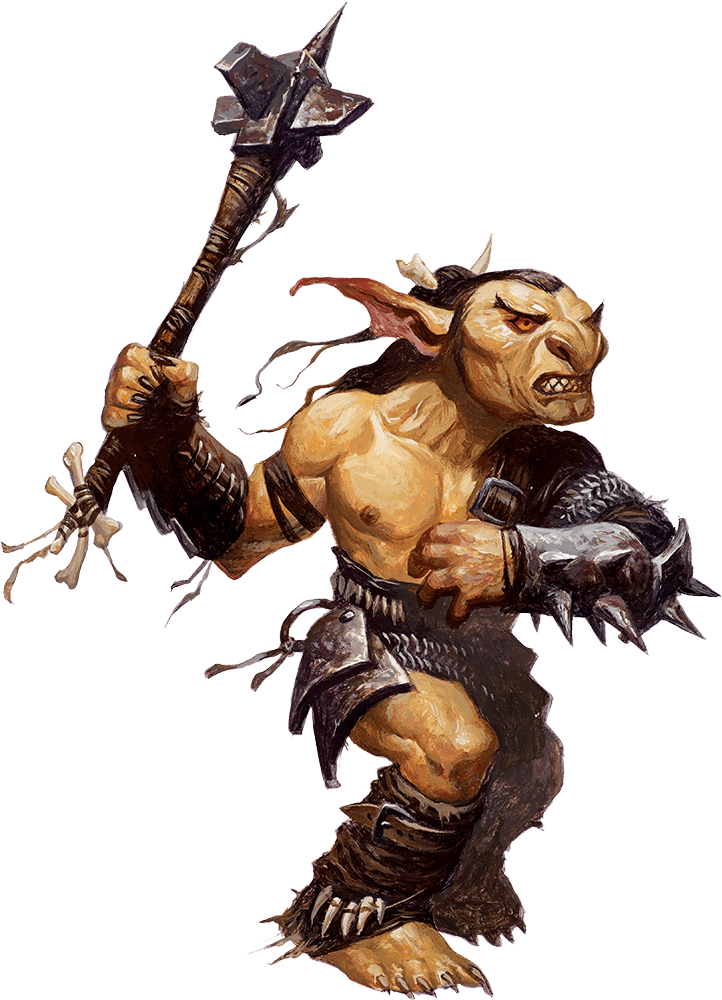

= Creatures

== Humanoid

=== Goblins

include::./creature.min.adoc[]

[cols="2a,4a",grid=rows]
|===
| image::./creature.token.webp[]
| 
Goblins are small, black-hearted humanoids that lair in despoiled dungeons and other dismal settings. Individually weak, they gather in large numbers to torment other creatures.
|
_Environment:_ + 
_Tags:_
|
Forest,Grassland,Hill,Underdark  +
Goblinoid
|===
