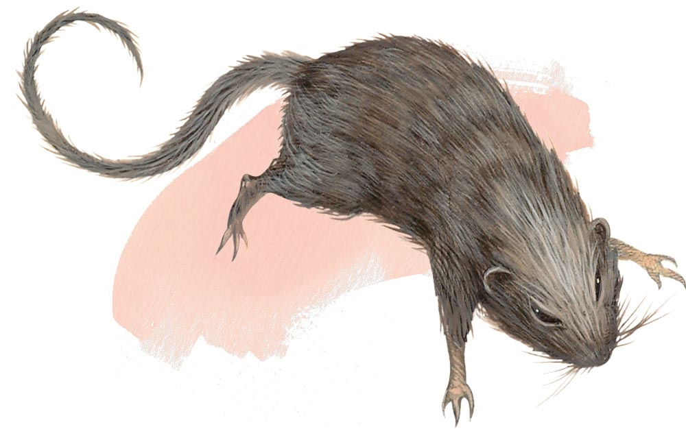

# Rat

**Tags:** #tiny, #beast, #unaligned

## Attributes
| STR     | DEX     | CON    | INT     | WIS     | CHA     |
| ------- | ------- | ------ | ------- | ------- | ------- |
|  2 [-4] | 11 [+0] | 9 [-1] |  2 [-4] | 10 [+0] |  4 [-3] |

## About
| Property    | Description |
| ----------- | ----------- |
| Type        | Tiny beast  |
| Morality    | Unaligned   |
| Challenge   | 0           |
| XP          | 10          |
| Proficiency | +2          |
| Initiative  | +0          |
| Armor       | 10          |
| HP value    | 1           |
| HP dice     | 1d4-1       |
| Speed       | 20 ft.      |

## Actions
**Bite.** Melee Weapon Attack: +0 to hit, reach 5 ft., one target. Hit: 1 piercing damage.

## Abilities
**Senses**: Darkvision 30 ft., Passive Perception 10 ft. 
**Keen Smell.** The rat has advantage on Wisdom (Perception) checks that rely on smell.